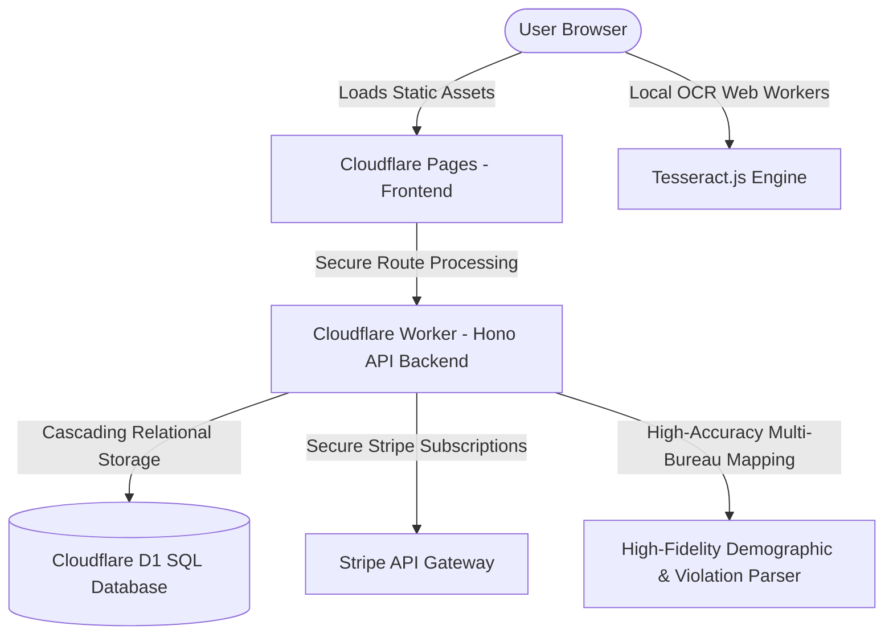

<p align="center">
  
</p>

# Smart FCRA — Credit advocacy CRM
### Engineered by **Rick Jefferson** | **RJ Business Solutions** · Empowering Generational Wealth

> **Separate project (v2)** — workbench branch cloned from production. Deploy target is `smart-fcra-v2` / DB `fcra-detector-v2`. **Do not merge into original `main`.** When finished, push to a new repo (`smart-FCRA-v2`). See [docs/NEW_VERSION.md](docs/NEW_VERSION.md).

[](https://smart-fcra.pages.dev)
[](https://www.typescriptlang.org/)
[](LICENSE)
[](#compliance--legal-auto-wiring)

---

## 💼 The Venture Capital & Enterprise Opportunity
Consumer credit inaccuracies represent a multi-billion dollar friction point in the financial sector. Over **79% of consumer credit files contain errors**, yet credit repair companies and consumer law firms spend countless manual hours parsing dense, image-heavy PDF reports trying to find statutory leverage.

**Smart FCRA** is an institutional-grade, highly automated SaaS platform that bridges the gap between raw credit data and statutory damages recovery. It ingests complex multi-bureau credit reports, executes client-side OCR for scanned files, merges disparate spelling records via fuzzy string-distance algorithms, and automatically uncovers violations of the **Fair Credit Reporting Act (FCRA - 15 U.S.C. § 1681)** and **Fair Debt Collection Practices Act (FDCPA)**.

**Operator catalog (every feature, every gap):** [docs/FEATURES.md](docs/FEATURES.md) · **Brand tokens:** [docs/DESIGN_SYSTEM.md](docs/DESIGN_SYSTEM.md) · **Live brand hub:** https://smart-fcra-v2.pages.dev/brand

### 📈 Economic Value Proposition (ROI)
* **Zero-Compute Client-Side OCR**: Reduces backend API and server bills to zero for high-overhead image parsing by leveraging web workers and client-side Tesseract.js.
* **Instant Case Valuation**: Instantly scores case values based on statutory violations ($1,000 per willful violation) to prioritize attorney caseloads automatically.
* **Autonomous Funnel Acquisition**: Integrates with standard onboarding platforms to turn raw user uploads into immediately draftable dispute letters and federal complaints in seconds.

---

## 🚀 Key Technological Innovations

### 1. High-Fidelity Client-Side OCR Pipeline
Standard parsers choke on scanned, image-only files or low-resolution faxes. **Smart FCRA** deploys a state-of-the-art browser-side OCR engine using a multi-threaded web worker model:
* **Automatic Scanned Document Detection**: Analyzes PDF.js text layer output; if character density is `< 1000`, the file is automatically rerouted to the OCR pipeline.
* **Scale-Clarity Rendering**: Renders PDF pages to offscreen canvas instances at a pixel-dense `1.5x` scale to optimize OCR letter recognition.
* **Asynchronous Progress Synchronization**: Updates progress indicators in real-time, giving clients a premium, state-of-the-art interactive experience.

### 2. Multi-Bureau Consolidated Matching Engine
To prevent database fragmentation (e.g. creating separate profiles for `Vacarria Keller`, `Vaccaria Keller`, and `Vacaria Keller`), the system implements a robust fuzzy clustering resolver:
* **Levenshtein Name Distances**: Evaluates phonetic and spelling deviations to group matching client profiles.
* **Identifier Conflict Guardrails**: Implements strict reject metrics (rejection confidence `-100`) if SSN last-4 or Date of Birth do not match.
* **Dynamic Property Merging**: When matching records are found, the engine updates missing profile fields (address, ZIP, DOB, SSN) dynamically, consolidating all three bureau reports under a *single, unified* workspace dashboard.

### 3. High-Precision Demographic Extraction
Features strict Horizontal Space Matching (`[A-Za-z\t \-']`) to prevent newline bleeding, coupled with a proprietary `isValidClientName` validator. This validates parsed names against a corporate boilerplate blacklist (excluding CFPB disclosures, terms like `including`, `credit`, `specialty`, `agencies`, `disclosure`, and more).

---

## 📦 System Architecture & Stack

The entire application is engineered for zero-latency execution, using the highly performant Cloudflare Serverless Edge stack:



* **Core Backend Framework**: [Hono](https://hono.dev/) on Cloudflare Workers/Pages edge runtime.
* **Client-Side Rendering**: Vite, TypeScript, Tailwind CSS, custom modern micro-animations.
* **Database**: Cloudflare D1 (SQLite at the Edge) with active cascade constraints for clean data lifecycle management.
* **Billing Gateway**: Stripe Billing & webhook sync for subscription tier gating.

---

## 📂 Repository Structure & Documentation

Our repository layout is engineered for immediate technical onboarding and institutional presentation:

```text
├── .wrangler/          # Local state and edge environment configuration
├── docs/               # Institutional and B2B Strategic Documentation
│   ├── PRD.md              # Product Requirements & Core User Stories
│   ├── STRATEGY.md         # Market Positioning & Stripe Monetization Model
│   ├── ARCHITECTURE.md     # System Architecture & Multi-Bureau Consolidated Flow
│   ├── API_CONTRACT.md     # Complete REST Endpoint Schema Definition
│   ├── SECURITY_AUDIT.md   # Threat Vector Modeling & Data Safety Analysis
│   ├── INFRASTRUCTURE.md   # Cloudflare Pages, Worker, and D1 Database Mapping
│   ├── DB_SCHEMA.md        # Relational SQLite D1 Entity Layout
│   ├── FEATURES.md         # Complete operator catalog + finish-up list
│   ├── DESIGN_SYSTEM.md    # RJ blue / Space Grotesk / Inter tokens
│   ├── ADR_LOG.md          # Architectural Decision Records
│   └── IP_PROTECTION_AND_LICENSING.md # Absolute Ownership & Sovereign IP Protection Deed
├── src/                # Edge Workers API & Parsing Engine Source Code
│   ├── engine/             # The Analytical Brain
│   │   ├── parser.ts           # High-Fidelity Demographic & Bureau Extraction
│   │   ├── violations.ts       # Statutorily-backed Infraction Detection Engine
│   │   ├── documents.ts        # Automated Legal Letter & Dispute PDF Builder
│   │   └── pdf-generator.ts    # Serverless PDF generation
│   └── index.tsx           # Hono App router, Auth middleware, and API endpoints
├── public/             # Browser Assets & Interactive Client Pipeline
│   └── static/
│       └── app.js              # PDF.js, Tesseract.js Multi-Threaded Ingestion Client
└── wrangler.toml       # Edge resource mappings & database bindings
```

---

## 🛡️ Compliance & Legal Auto-Wiring
* **Statutory Rigor**: The parser matches standard credit items directly to consumer law protections:
  * **15 U.S.C. § 1681i**: Right to dispute inaccurate items (30-day investigation requirements).
  * **15 U.S.C. § 1681b**: Permissible purpose violations for unauthorized inquiries.
  * **FDCPA 15 U.S.C. § 1692**: Unfair and deceptive collection activity mappings.
* **Privacy Controls**: All OCR processing runs client-side inside the user's browser, ensuring sensitive credit files and SSNs are parsed locally without unnecessary transit of unencrypted PII across external servers.

---

## ⚙️ Getting Started for Technical Evaluators

### Prerequisites
* [Node.js](https://nodejs.org/) v18+ & `npm` / `pnpm`
* Cloudflare Account with [Wrangler](https://developers.cloudflare.com/workers/wrangler/) CLI configured.

### Live demo (share this)

- **URL:** https://smart-fcra-v2.pages.dev  
- **Staff:** `demo@example.com` / `demo123456`  
- Walkthrough: [docs/DEMO_WALKTHROUGH.md](docs/DEMO_WALKTHROUGH.md)

### Local Development Setup
1. **Clone the Repository**:
   ```bash
   git clone https://github.com/rjbizsolution23-wq/smart-FCRA.git
   cd smart-FCRA
   ```
2. **Install Dependencies**:
   ```bash
   npm install
   ```
3. **Local secrets**:
   ```bash
   cp .dev.vars.example .dev.vars
   ```
4. **Apply Database Migrations (Local D1 Dev Sandbox)**:
   ```bash
   npx wrangler d1 migrations apply fcra-detector-v2 --local
   ```
5. **Seed Sandbox Data**:
   ```bash
   npx wrangler d1 execute fcra-detector-v2 --local --file=./seed.sql
   ```
6. **Run Local Dev Server**:
   ```bash
   npx vite
   ```
   Local `wrangler pages dev` requires a Cloudflare API token when AI/R2 remote bindings are active. For an immediate show, use the live demo URL above.
### Deploying to Production (Cloudflare Pages)
Compile assets and promote to the **separate** Cloudflare Pages project (`smart-fcra-v2` — does not overwrite original `smart-fcra`):
```bash
npx wrangler pages deploy dist --project-name smart-fcra-v2
```

---

## 🌟 RJ Business Solutions Premium Standard
* **Engineered Right**: Named correctly, built right, shipped clean.
* **Enterprise Grade**: Designed to support thousands of concurrent requests with robust security and sub-second edge response times.
* **VC Ready**: Fully structured repository with clean code discipline, detailed documentation, and immediate monetization readiness.

For custom business customizations or enterprise licensing options, reach out to our team:
* **Website**: [https://rickjeffersonsolutions.com](https://rickjeffersonsolutions.com)
* **Email**: [support@rjbusinesssolutions.org](mailto:support@rjbusinesssolutions.org)
* **Owner**: Rick Jefferson, Principal prompt architect & full stack developer

---
© 2026 Rick Jefferson | RJ Business Solutions. All rights reserved. Registered trademark.
<!-- deploy-trigger: 2026-08-27T19:30:55Z redeploy after Actions billing fix -->
<!-- cf-secrets-verify: 2026-08-27T19:45:56Z verify GitHub Actions can deploy to Cloudflare Pages -->
