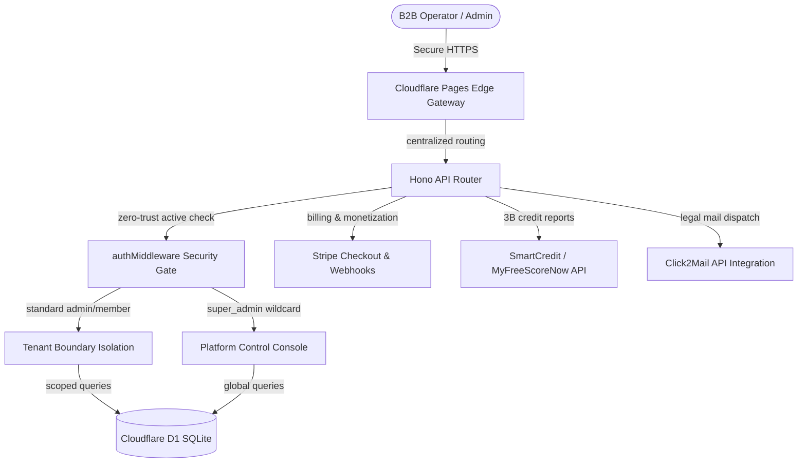

# 🧠 SmartFCRA™ Supreme — API Integrations & Specifications Manual
## Corporate-Grade Multi-Tenant Integration Blueprint
### Powered by NeuronEdge Labs™ & RJ Business Solutions

This manual serves as the technical single-source-of-truth (SSOT) and API contract for **SmartFCRA™ Supreme**, managed by **Rick Jefferson (RJ Business Solutions)**. It defines every backend REST API endpoint, security gateway protocol, relational database schema, and third-party commercial integration.

⏰ **Anchor Date:** 2026-07-08 MST  
🏢 **Corporate Owner:** Rick Jefferson | RJ Business Solutions  
🔒 **Classification:** Restricted Commercial Intellectual Property  

---

## 🗺️ System Architecture Overview

SmartFCRA™ Supreme is engineered as an edge-native, zero-trust SaaS platform running on Cloudflare Pages/Workers, utilizing Cloudflare D1 as its secure relational SQLite database.



---

## 🔒 Security Gateways & Session Validation

### 1. The Zero-Trust `authMiddleware`
Rather than verifying status only during login, **every single API request** undergoes dynamic, active verification. If a user or their organization is suspended, they are locked out in real-time.

```typescript
// Active middleware validation block on every endpoint request
async function authMiddleware(c: any, next: any) {
  const sessionId = c.req.header('Authorization')?.replace('Bearer ', '') || c.req.query('token');
  if (!sessionId) return c.json({ error: 'Unauthorized' }, 401);

  const session = await c.env.DB.prepare(
    'SELECT s.*, u.is_active, u.org_id, u.role FROM sessions s JOIN users u ON s.user_id = u.id WHERE s.id = ? AND s.expires_at > datetime("now")'
  ).bind(sessionId).first();

  if (!session) return c.json({ error: 'Session expired' }, 401);

  // Surgical User Block
  if (session.is_active === 0) {
    return c.json({ error: 'User account suspended' }, 403);
  }

  // Tenant suspension blanket
  const org = await c.env.DB.prepare('SELECT settings FROM organizations WHERE id = ?').bind(session.org_id).first();
  if (org) {
    const settings = JSON.parse(org.settings || '{}');
    if (settings.suspended === true) {
      return c.json({ error: 'Organization suspended' }, 403);
    }
  }

  c.set('session', session);
  await next();
}
```

---

## 📂 REST API Directory

All API endpoints are prefixed with `/api`. All protected endpoints require a valid session token passed via the `Authorization: Bearer <session_id>` header.

### 1. Authentication & Session Control

#### `POST /api/auth/register`
Creates a brand-new tenant organization and registers the primary owner (administrator).
* **Payload (JSON):**
  ```json
  {
    "company_name": "Jefferson Growth Co",
    "email": "owner@jeffersongrowth.com",
    "password": "secure_password_hash_123"
  }
  ```
* **Success Response (201 Created):**
  ```json
  {
    "success": true,
    "user_id": "usr_789421",
    "org_id": "org_847291"
  }
  ```

#### `POST /api/auth/login`
Validates user credentials, records IP telemetry, and returns a session cookie token.
* **Payload (JSON):**
  ```json
  {
    "email": "demo@example.com",
    "password": "demo123"
  }
  ```
* **Success Response (200 OK):**
  ```json
  {
    "token": "sess_847291-a15111fa-b730-4d1a-81a5",
    "user": {
      "id": "usr_demo_001",
      "name": "Rick Jefferson",
      "email": "demo@example.com",
      "role": "super_admin"
    }
  }
  ```

#### `POST /api/auth/logout`
Destroys the current active session in SQLite and clears the local state.
* **Headers:** `Authorization: Bearer <token>`
* **Success Response (200 OK):** `{"success": true}`

#### `GET /api/auth/me`
Pulls session details and role credentials of the currently logged-in operator.
* **Success Response (200 OK):**
  ```json
  {
    "user": {
      "id": "usr_demo_001",
      "org_id": "org_001",
      "email": "demo@example.com",
      "role": "super_admin",
      "name": "Rick Jefferson"
    }
  }
  ```

---

### 2. Client Registry (Tenant-Scoped)

#### `GET /api/clients`
Returns a directory of all clients registered under the authenticated operator's tenant organization.
* **Success Response (200 OK):**
  ```json
  {
    "clients": [
      {
        "id": "cli_001",
        "first_name": "Rick",
        "last_name": "Jefferson",
        "email": "client@example.com",
        "phone": "+1 (414) 430-4277",
        "created_at": "2026-07-08T12:00:00Z"
      }
    ]
  }
  ```

#### `POST /api/clients`
Registers a new consumer client. PII values are automatically encrypted at rest using Aes-256-Gcm inside the database.
* **Payload (JSON):**
  ```json
  {
    "first_name": "John",
    "last_name": "Doe",
    "email": "johndoe@gmail.com",
    "phone": "555-555-5555",
    "ssn": "XXX-XX-XXXX",
    "dob": "1990-01-01"
  }
  ```
* **Success Response (201 Created):**
  ```json
  {
    "success": true,
    "client": { "id": "cli_984729" }
  }
  ```

---

### 3. Credit Ingestion & Analysis Engine

#### `POST /api/reports/upload`
Uploads and parses a text/PDF credit report, executing standalone Tesseract OCR and triggering immediate FCRA/FDCPA compliance violation checks.
* **Payload:** `multipart/form-data` containing `report_file` and `client_id`.
* **Success Response (200 OK):**
  ```json
  {
    "success": true,
    "report_id": "rep_284192",
    "violations_detected": 14,
    "litigation_score": 84
  }
  ```

#### `GET /api/reports/:id`
Retrieves granular account parsing arrays (tradelines, balances, late marks) and mapped violations.
* **Success Response (200 OK):**
  ```json
  {
    "report": {
      "id": "rep_284192",
      "client_name": "John Doe",
      "bureau": "Equifax",
      "parsed_data": {
        "tradelines": [
          { "account_number": "123XX", "creditor": "Chase Card", "status": "Inaccurate" }
        ]
      }
    }
  }
  ```

---

### 4. Legal Document Generation

#### `POST /api/documents/generate`
Generates a court-admissible FCRA dispute letter or lawsuit complaint using structured regulatory templates.
* **Payload (JSON):**
  ```json
  {
    "client_id": "cli_984729",
    "violations": ["viol_001", "viol_002"],
    "document_type": "1681i_credit_bureau_dispute"
  }
  ```
* **Success Response (201 Created):**
  ```json
  {
    "success": true,
    "document_id": "doc_948123"
  }
  ```

#### `POST /api/documents/:id/send`
Dispatches the legal document physically via mail using integrated postal endpoints.
* **Success Response (200 OK):**
  ```json
  {
    "success": true,
    "mailing_job_id": "job_c2m_92841"
  }
  ```

---

### 5. Platform Super Admin Control Console

These controllers bypass B2B tenant boundaries and can only be invoked by users possessing the `super_admin` role.

#### `GET /api/admin/db-stats`
Pulls global cross-tenant counts of all active database entities and WebSocket session logs.
* **Success Response (200 OK):**
  ```json
  {
    "stats": {
      "organizations": 82,
      "users": 194,
      "clients": 1142,
      "reports": 3192,
      "violations": 12410,
      "documents": 841,
      "active_sessions": 24
    }
  }
  ```

#### `GET /api/admin/organizations`
Returns a comprehensive global directory of all platform tenants.
* **Success Response (200 OK):**
  ```json
  {
    "organizations": [
      {
        "id": "org_001",
        "name": "RJ Solutions Demo",
        "slug": "rj-solutions-demo",
        "plan": "enterprise",
        "max_users": 50,
        "max_clients": 500,
        "max_reports_per_month": 1000,
        "settings": "{\"suspended\":false}"
      }
    ]
  }
  ```

#### `POST /api/admin/organizations/:id`
Updates B2B tenant commercial boundaries and plan tiers dynamically.
* **Payload (JSON):**
  ```json
  {
    "name": "Expanded Enterprise",
    "plan": "unlimited",
    "max_users": 100,
    "max_clients": 5000,
    "max_reports_per_month": 10000
  }
  ```
* **Success Response (200 OK):** `{"success": true}`

#### `POST /api/admin/organizations/:id/toggle-suspension`
Enforces a security blanket lockout suspending/unsuspending an entire tenant.
* **Success Response (200 OK):**
  ```json
  {
    "success": true,
    "suspended": true
  }
  ```

#### `GET /api/admin/users`
Returns a global directory of all registered platform users.
* **Success Response (200 OK):**
  ```json
  {
    "users": [
      {
        "id": "usr_demo_001",
        "name": "Rick Jefferson",
        "email": "demo@example.com",
        "org_name": "RJ Solutions Demo",
        "role": "super_admin",
        "is_active": 1,
        "last_login": "2026-07-08T14:00:00Z"
      }
    ]
  }
  ```

#### `POST /api/admin/users/:id/toggle-status`
Deactivates/activates a specific user and instantly evicts all their live session tokens from the database.
* **Success Response (200 OK):**
  ```json
  {
    "success": true,
    "is_active": 0
  }
  ```

#### `GET /api/admin/logs`
Returns the last 100 system audit trail records for compliance inspection.
* **Success Response (200 OK):**
  ```json
  {
    "logs": [
      {
        "id": 142,
        "user_email": "operator@test.com",
        "org_name": "Jefferson Growth Co",
        "action": "DOCUMENT_GENERATE",
        "description": "Generated Equifax Dispute Letter for John Doe",
        "created_at": "2026-07-08T14:32:00Z"
      }
    ]
  }
  ```

---

## 💳 Stripe Monetization Integration Spec

We enforce a **strict no free trials** monetization standard. All billing transitions use secure cryptographic webhook verify tags.

### Supported Subscription Plans
1. **Pro Plan (`pro`)**: $497 / month. Limited to 5 users, 50 clients, and 100 credit reports per month.
2. **Unlimited Plan (`unlimited`)**: $2,500 / month. Unlocks unlimited team members, clients, and report analysis sweeps.

### Stripe Webhook Handler: `POST /api/billing/webhook`
Listens for asynchronous events dispatched by Stripe. The endpoint validates signatures to prevent spoofing:

```typescript
const sig = c.req.header('Stripe-Signature');
const event = stripe.webhooks.constructEvent(body, sig, env.STRIPE_WEBHOOK_SECRET);
```

#### Event Handling Policies:
- `checkout.session.completed`: Locates the associated tenant using `client_reference_id` passed in metadata, upgrades their SQL record plan status, and records transaction logs.
- `customer.subscription.updated`: Synchronizes modified credit cards, billing cycles, or seat expansions.
- `customer.subscription.deleted`: Toggles the tenant subscription status to expired and locks boundaries.

---

## 📊 MyFreeScoreNow (MFSN) Bureau Integration Spec

SmartFCRA™ Supreme automates the retrieval of authentic Experian, Equifax, and TransUnion (3-Bureau) credit reports through a direct bridge with MyFreeScoreNow.

### 1. Ingestion Flow (Affiliate-only enrollment)
Consumers must enroll through RJ Business Solutions MyFreeScoreNow affiliate offers (ID suffix `A8289`), e.g.:
`https://app.myfreescorenow.com/enroll/B01A8289`

Full offer + commission catalog: `src/data/mfsn-affiliate-offers.ts` and `docs/funding/MFSN_INTEGRATION.md`.
Public signup rejects members who are not under this affiliate (partner API `User not found` → enroll first).

### 2. Retrieval Bridge: `POST /api/reports/import-mfsn`
Once enrolled, the consumer's credentials are securely verified using MFSN backend API endpoints. The credit report data (returned in standardized JSON/XML format) is mapped to our database using our optimized adapter schema.

```json
{
  "MFSN_Payload": {
    "BureauData": {
      "Equifax": { "AccountHistory": [...] },
      "Experian": { "AccountHistory": [...] },
      "TransUnion": { "AccountHistory": [...] }
    }
  }
}
```

Our mapping engine [src/engine/mfsn-mapper.ts](file:///c:/Users/ricky/Downloads/fcra-detector-main/fcra-detector-main/src/engine/mfsn-mapper.ts) converts these separate bureau segments into standardized unified tradelines, triggering our compliance violation detectors.

---

## 📯 Click2Mail Automated Mailing Spec

Automated physical mailing uses Click2Mail's secure REST endpoints to print and Certified-mail legal letters directly to credit bureaus and furnishers.

* **API Endpoint:** `POST /api/documents/:id/send`
* **Workflow:**
  1. Retrieves the generated document PDF.
  2. Submits a document creation job to Click2Mail:
     `POST /rest/v1/documents`
  3. Configures delivery boundaries (Certified Mail with Return Receipt Requested) and submits the shipping address payload:
     `POST /rest/v1/jobs`
  4. Triggers print dispatch and records the routing transit numbers to the database activity log.

---

## 🗄️ Relational Database Schema Design (Cloudflare D1)

```sql
-- Organizations (B2B Tenants)
CREATE TABLE organizations (
  id TEXT PRIMARY KEY,
  name TEXT NOT NULL,
  slug TEXT UNIQUE NOT NULL,
  plan TEXT DEFAULT 'free',
  max_users INTEGER DEFAULT 1,
  max_clients INTEGER DEFAULT 10,
  max_reports_per_month INTEGER DEFAULT 5,
  stripe_customer_id TEXT,
  stripe_subscription_id TEXT,
  settings TEXT DEFAULT '{}',
  created_at TEXT DEFAULT CURRENT_TIMESTAMP
);

-- Users
CREATE TABLE users (
  id TEXT PRIMARY KEY,
  org_id TEXT REFERENCES organizations(id),
  name TEXT NOT NULL,
  email TEXT UNIQUE NOT NULL,
  password_hash TEXT NOT NULL,
  role TEXT CHECK(role IN ('super_admin', 'admin', 'member')) DEFAULT 'member',
  is_active INTEGER DEFAULT 1,
  created_at TEXT DEFAULT CURRENT_TIMESTAMP
);

-- Sessions
CREATE TABLE sessions (
  id TEXT PRIMARY KEY,
  user_id TEXT REFERENCES users(id),
  org_id TEXT REFERENCES organizations(id),
  expires_at TEXT NOT NULL,
  created_at TEXT DEFAULT CURRENT_TIMESTAMP
);

-- Clients (PII fields are stored in Aes-256-Gcm ciphertext)
CREATE TABLE clients (
  id TEXT PRIMARY KEY,
  org_id TEXT REFERENCES organizations(id),
  first_name TEXT NOT NULL,
  last_name TEXT NOT NULL,
  email TEXT,
  phone TEXT,
  ssn_encrypted TEXT,
  dob_encrypted TEXT,
  address TEXT,
  created_at TEXT DEFAULT CURRENT_TIMESTAMP
);

-- Credit Reports
CREATE TABLE credit_reports (
  id TEXT PRIMARY KEY,
  org_id TEXT REFERENCES organizations(id),
  client_id TEXT REFERENCES clients(id),
  bureau TEXT NOT NULL,
  parsed_data TEXT, -- Standardized structured JSON tradeline array
  litigation_score INTEGER DEFAULT 0,
  created_at TEXT DEFAULT CURRENT_TIMESTAMP
);

-- Violations
CREATE TABLE violations (
  id TEXT PRIMARY KEY,
  org_id TEXT REFERENCES organizations(id),
  report_id TEXT REFERENCES credit_reports(id),
  severity TEXT CHECK(severity IN ('critical', 'high', 'medium', 'low')),
  statute TEXT NOT NULL, -- e.g., '15 U.S.C. 1681i'
  creditor TEXT NOT NULL,
  details TEXT NOT NULL,
  is_resolved INTEGER DEFAULT 0,
  created_at TEXT DEFAULT CURRENT_TIMESTAMP
);

-- Legal Dispute Dispute Documents
CREATE TABLE documents (
  id TEXT PRIMARY KEY,
  org_id TEXT REFERENCES organizations(id),
  client_id TEXT REFERENCES clients(id),
  report_id TEXT REFERENCES credit_reports(id),
  type TEXT NOT NULL,
  content_html TEXT NOT NULL,
  status TEXT CHECK(status IN ('draft', 'generated', 'sent', 'delivered')) DEFAULT 'draft',
  created_at TEXT DEFAULT CURRENT_TIMESTAMP
);

-- Global Security & Activity Audit Log
CREATE TABLE activity_logs (
  id INTEGER PRIMARY KEY AUTOINCREMENT,
  org_id TEXT REFERENCES organizations(id),
  user_id TEXT REFERENCES users(id),
  user_email TEXT NOT NULL,
  action TEXT NOT NULL,
  description TEXT NOT NULL,
  client_id TEXT,
  document_id TEXT,
  report_id TEXT,
  ip_address TEXT,
  created_at TEXT DEFAULT CURRENT_TIMESTAMP
);
```

---
🏢 **RJ Business Solutions** • Zero-Defect Enterprise Engineering  
