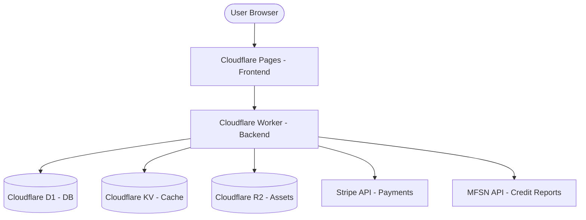

# Architecture — FCRA Supreme Violation Detector

## System Overview
The FCRA Supreme Violation Detector is a serverless SaaS platform built on the Cloudflare stack. It leverages Edge Computing for low-latency analysis and high-performance relational storage at the edge.

## Diagram (Mermaid)

## Data Flow
1. **Ingest**: User provides MFSN credentials via Frontend.
2. **Retrieve**: Worker authenticates with MFSN and pulls Tri-Bureau JSON.
3. **Analyze**: Worker maps JSON to internal types and runs violation detection engine.
4. **Persist**: Reports and detected violations are saved to D1.
5. **Billing**: Organization and subscription state is synchronized via Stripe Webhooks.

## Component Breakdown
- **Hono**: Backend routing framework.
- **MFSN Mapper**: Transforms third-party credit data into analysis-ready formats.
- **Violation Engine**: Rule-based detection logic with litigation scoring.
- **Auth**: Secure JWT session management.
