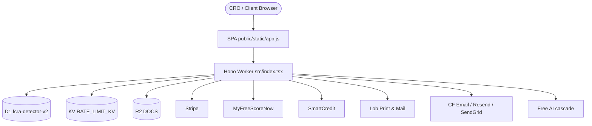

# Architecture — Smart FCRA Supreme v2

> **Full CRO / GTM blueprints:** [`ARCHITECTURE_BLUEPRINT.md`](./ARCHITECTURE_BLUEPRINT.md)  
> **Readiness / gaps:** [`PRODUCTION_READINESS_REPORT.md`](./PRODUCTION_READINESS_REPORT.md)

## System Overview

Serverless SaaS on Cloudflare Pages + Hono Worker. Edge D1 (relational), R2 (document vault), KV (rate limits), Workers AI + free LLM cascade for mentors/summaries.

## Diagram

## Core data flow

1. **Ingest** — ACR PDF/OCR, MFSN JSON, SmartCredit, or pasted text  
2. **Analyze** — `detectViolations` + Metro 2 + fact-check → LVS  
3. **Strategize** — `letter-strategy` picks the right letter pack  
4. **Brand** — org letterhead on letter body + PDF  
5. **Act** — Lob mail (postage-gated) / download / e-sign  
6. **Learn** — bureau reply upload classification updates the file  
7. **Engage** — daily motivation + ops cron packs  

## Component map

| Area | Path |
|------|------|
| API + shell | `src/index.tsx` |
| Parsers / mappers | `src/engine/parser.ts`, `mfsn-*`, `smartcredit-mapper.ts` |
| Legal engine | `src/engine/violations*.ts`, `violation-factcheck.ts` |
| Letters | `src/engine/documents.ts`, `letter-strategy.ts` |
| Branding | `src/lib/org-branding.ts`, `pdf-generator.ts` |
| Reply intel | `src/engine/bureau-reply-intel.ts` |
| Import orchestration | `src/lib/bureau-import.ts` |
| Comms / ops | `src/lib/email*.ts`, `ops-scheduler.ts`, `portal-journey.ts` |
| Schema | `migrations/0001`–`0015` |
