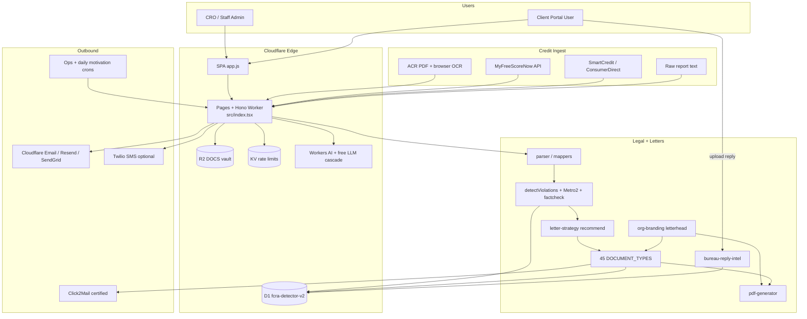
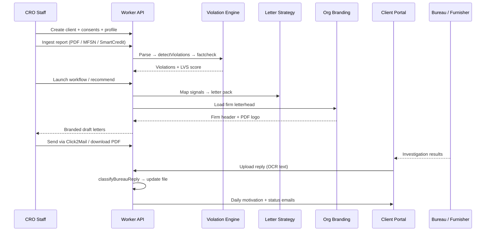

# Smart FCRA v2 — System Architecture Blueprint (CRO / Go-to-Market)

**Live:** https://smart-fcra-v2.pages.dev  
**Stack:** Cloudflare Pages + Hono Worker · D1 · R2 · KV · Workers AI  
**SPA:** `public/static/app.js` (production). React under `src/frontend/` is legacy.

---

## 1. High-level system map

---

## 2. End-to-end case pipeline (winning the file)

---

## 3. Ingestion paths (all must work)

| Source | Entry | Parser | Notes |
|--------|-------|--------|-------|
| AnnualCreditReport PDFs | Browser PDF.js + Tesseract → `/api/reports/upload` | `parser.ts` + bureau-utils | No ACR.com API — OCR path |
| MyFreeScoreNow | `/api/reports/mfsn-import` | `mfsn-client` + `mfsn-mapper` | Needs `MFSN_EMAIL` / `PASSWORD` / `CLIENT_TOKEN` |
| SmartCredit | `/api/reports/import-smartcredit` | `smartcredit-mapper` | Live keys required; sandbox mock **blocked in production** |
| Paste / text | `/api/reports/upload` | `parser.ts` | Fallback |

Shared persist: `lib/bureau-import.ts` → D1 `credit_reports` + `violations`.

---

## 4. Legal / Metro 2 engine

| Module | Role |
|--------|------|
| `violations.ts` | Master detect + LVS |
| `violations-metro2.ts` | Metro 2 technical rules |
| `violations-fcra-core.ts` / `-fdcpa` / `-ecoa` / `-state-laws` / `-bankruptcy` | Statute packs |
| `violation-factcheck.ts` | Groundedness filter |
| `case-law-database.ts` + `knowledge-base.ts` | Litigation support text |
| `letter-strategy.ts` | **Intelligent letter selection** from signals |

Mentors (`lib/mentors.ts`) are AI explainers — the production pipeline is deterministic rules + fact-check, not a free-form agent swarm.

---

## 5. Branding contract (every letter)

1. Staff fills **Settings → Firm Letterhead** (name, address, phone, email, bar #, logo, hired-advocate flags).
2. `PUT /api/settings/org` stores nested `settings.letterhead` **and** flattens PDF/email keys via `mergeLetterheadIntoSettings`.
3. Every `documents/generate`, `generate-bulk`, and workflow pack runs `brandLetterContent()` so the firm header is in the letter body.
4. `GET /api/documents/:id/pdf` resolves the same letterhead (logo banner + firm footer + CROA disclosure when flagged).

---

## 6. Communications & ops

| Job | Trigger | Purpose |
|-----|---------|---------|
| Daily motivation | `daily-motivation.yml` → `/api/cron/daily-motivation` | Client engagement |
| Enterprise comms | `enterprise-comms.yml` | Drip / lifecycle email |
| Ops hourly/daily/weekly/monthly | `ops-*.yml` → `/api/cron/ops` | Housekeeping, compliance snapshots |
| Alerts | `lib/alerts.ts` | Email + optional Twilio SMS |
| Bureau reply | Portal upload category `creditor_reply` / `bureau_response` | Auto-classify + update dispute status |

---

## 7. Data model (core)

`organizations` (settings JSON = branding) → `users` / `sessions` → `clients` → `credit_reports` → `violations` → `documents`  
Portal: `portal_uploads`, `portal_messages`, `portal_alerts`, journey/tutor tables  
Comms: `email_delivery_log`, `scheduled_job_runs`  
Vault: R2 keys on `portal_uploads`  
Migrations: `0001`–`0015` (all applied on production D1).

---

## 8. Production readiness gates

| Gate | Status |
|------|--------|
| D1 migrations 0001–0015 | Applied remotely |
| `/api/health` + `/api/health/ready` | Live |
| Firm letterhead → PDF/body | Wired |
| Intelligent letter pack | Wired (`letter-strategy` + workflow) |
| Bureau reply classify | Wired |
| SmartCredit sandbox in prod | Blocked |
| MFSN / SmartCredit secrets | Operator — see readiness probe |
| Twilio SMS / RON vendor | Optional |
| Stripe webhook secret | Optional but recommended |

Operator checklist: `docs/PRODUCTION_LAUNCH_CHECKLIST.md`  
Gap tracker: `docs/PRODUCTION_READINESS_REPORT.md`
