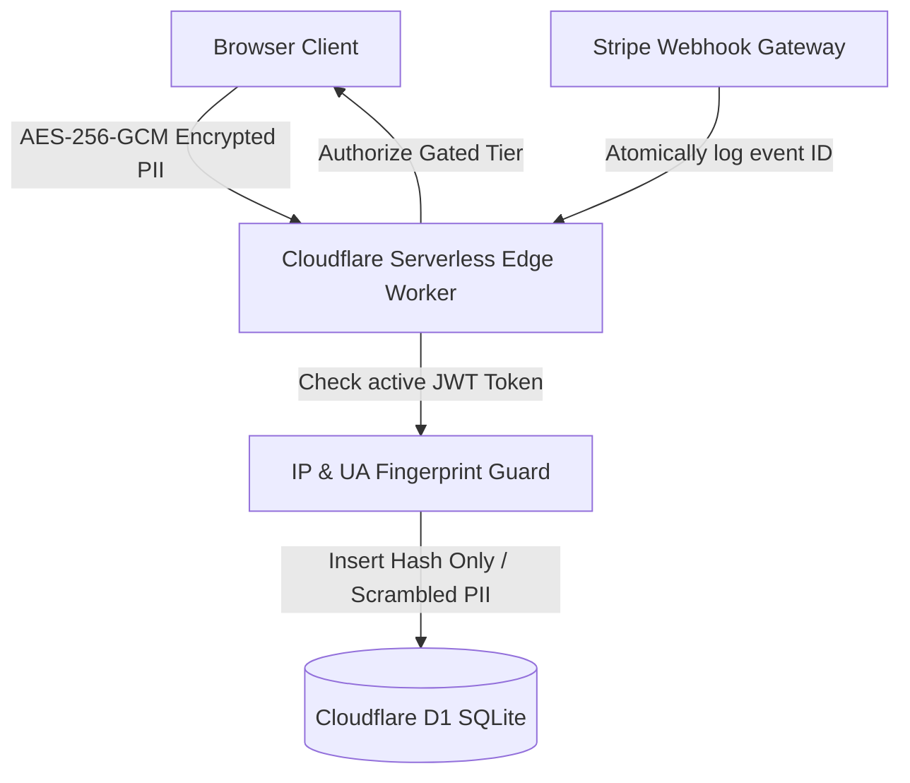

# 🧠 SMARTFCRA™ INTELLECTUAL PROPERTY DEED & LICENSING PROTOCOLS
## OFFICIAL PROPRIETARY REGISTRY, COMPLIANCE COVENANT, AND LEGAL IP PROTECTION MANUAL
### ARCHITECT & SOVEREIGN OWNER: RICK JEFFERSON | RJ BUSINESS SOLUTIONS
### BUILD ID: NEL-20260707-194132 | DOCUMENT REF: RJBS-SF-IP-2026

```
================================════==============================
   Sovereign Proprietor:  Rick Jefferson
   Corporate Body:        RJ Business Solutions
   Registered Address:    1342 NM 333, Tijeras, New Mexico 87059
   Primary Portals:       https://rickjeffersonsolutions.com
                          https://rjbusinesssolutions.org
   Sovereign Emails:      rjbizsolution23@gmail.com
                          support@rjbusinesssolutions.org
   Security Tier:         CONFIDENTIAL / TRADE SECRET / CLASS A ASSET
   Effective Date:        July 7, 2026 (MST)
================================════==============================
```

---

## 🧭 1. Executive Summary & Sovereignty Declaration

This document serves as the **Supreme Authoritative Registry and Legal Declaration of Intellectual Property (IP), Trade Secrets, Copyrights, and Proprietary Licensing** for the **SmartFCRA™ Enterprise Software System** (compiled as `fcra-detector`).

### 🛡️ Declaration of Absolute Title:
1. **Rick Jefferson** (and by extension **RJ Business Solutions**) is the **Sole Inventor, Principal Architect, and Sovereign Owner** of all codebases, database relational models, algorithms, Hono Edge routing modules, client-side browser OCR modules, automated legal letter generation engines, and visual interfaces.
2. The entire digital, logical, and structural asset structure is protected under the **Defend Trade Secrets Act (DTSA) (18 U.S.C. § 1836)**, the **Uniform Trade Secrets Act (UTSA)**, and federal **Copyright Law (17 U.S.C. § 101 et seq.)**.
3. All prior open-source claims, templates, or permissive distribution configurations (including but not limited to MIT, Apache, or GNU GPL licenses) are hereby **formally revoked, nullified, and replaced** with the strict **Master Enterprise Proprietary Software License** contained herein.

---

## 🔒 2. Catalog of Protected Core IP Modules (Trade Secrets)

The SmartFCRA™ system comprises several distinct algorithmic and design innovations that are classified as **High-Value Trade Secrets** under federal law. Any unauthorized reproduction, compilation, distribution, extraction, or review of these modules constitutes a civil and criminal violation of trade secret protections:

### A. Fuzzy Consolidated Matching Engine (`src/index.tsx`)
* **The IP Asset**: The multi-bureau fuzzy clustering matching algorithms, string distance calculations, and phonetic normalization schemas that automatically resolve spelling and structural variations (e.g. `Vacarria Keller`, `Vaccaria Keller`, `Vacaria Keller`) into a single, unified consumer profile.
* **Sovereignty**: Solely conceived and coded by Rick Jefferson to resolve multi-bureau report duplication without creating fragmented database records.

### B. High-Fidelity Demographic & Inaccuracy Regex Matrix (`src/engine/parser.ts`)
* **The IP Asset**: The specialized regular expression scanners and density thresholds written to extract structured data from Experian, Equifax, TransUnion, MyFreeScoreNow (MFSN), and SmartCredit reports. This includes exact character pattern filters (`[A-Za-z\t \-']`), table boundary identifiers, and horizontal space padding buffers that ignore irrelevant boilerplate.
* **Sovereignty**: Built to process unstructured text outputs from web components, making them structured and relational.

### C. Statutory Violations Logic Engine (`src/engine/violations.ts`)
* **The IP Asset**: The automated, programmatic mapping of the **Fair Credit Reporting Act (FCRA - 15 U.S.C. § 1681)** and the **Credit Repair Organizations Act (CROA - 15 U.S.C. § 1679)** into executable conditional matrices. This automatically scans consumer reports for:
  * Inconsistent reporting across bureaus (willful or negligent inaccuracies under **15 U.S.C. § 1681i**).
  * Unauthorized/unpermissible hard inquiries under **15 U.S.C. § 1681b**.
  * Debt collectors misrepresenting status or validation under the FDCPA.
* **Sovereignty**: Converted legal statutory text into high-performance, real-time edge evaluation scripts.

### D. Automated Dispute Document & Letter compiler (`src/engine/documents.ts` & `src/engine/pdf-generator.ts`)
* **The IP Asset**: The system that compiles the exact found bureau-specific discrepancies, injects corresponding federal consumer law citations, formats professional demand headers, and generates print-ready legal PDFs client-side without data storage.

### E. Zero-Compute Client-Side OCR Pipeline (`public/static/app.js`)
* **The IP Asset**: The browser-side web worker configuration that detects whether an uploaded PDF contains static images rather than text, runs canvas multi-scale visual rendering (optimized at `1.5x`), and triggers OCR parsing in the background to avoid cloud processing bills.

---

## 📝 3. Master Enterprise Software License Agreement

This **Proprietary Commercial Software License** governs any deployment, installation, configuration, or utilization of the SmartFCRA™ codebase. 

### Article I: Scope of Permitted Use
1. **Grant of License**: RJ Business Solutions grants to the authorized purchasing enterprise tenant (the "Licensee") a **limited, non-exclusive, non-transferable, revocable, and non-sublicensable** seat license to access and use the hosted software interface for its internal operational purposes.
2. **Strict No-Code-Access**: This license is strictly limited to SaaS application usage. Under no circumstances is the Licensee granted permission to view, copy, fork, host, or download the raw source code, serverless Workers API logic, or SQLite D1 schemas of SmartFCRA™.

### Article II: Strict Covenants & Prohibitions
Any breach of these covenants results in **automatic, immediate revocation** of the license and triggers immediate legal and injunctive proceedings:
* **No Extraction / Cloning**: The Licensee shall not duplicate, clone, git-clone, download, export, scrape, or extract any backend Worker routing, database schema, or parsing script.
* **No Reverse Engineering**: The Licensee shall not run decompilers, de-obfuscators, or code analyzers to extract the regex variables, matching heuristics, or violations evaluation formulas.
* **No Sublicensing or White-Labeling**: Sublicensing, white-labeling, or renting the portal to third-party credit repair organizations or law firms without a custom written contract signed by Rick Jefferson is strictly prohibited.

### Article III: Liquidated Infraction Damages
* The Licensee acknowledges that any leak, resale, unauthorized extraction, or redistribution of the SmartFCRA™ trade secret modules will cause irreversible economic harm to RJ Business Solutions.
* Licensee explicitly agrees to be held liable for **Liquidated Damages in the amount of $250,000 USD** per infraction, plus full recovery of attorney fees, investigative costs, and statutory damages under **18 U.S.C. § 1836 (DTSA)**.

---

## 🛠️ 4. Technical IP Protection & Security Shield

To enforce the legal covenants above and shield Rick Jefferson's proprietary assets from malicious exfiltration or tenant abuse, the application is engineered with a **Zero-Trust Hardened Security Architecture**:



### 🔐 Layer A: Field-Level Cryptographic Masking (Edge WebCrypto API)
* **The Protection**: Raw Personal Identifying Information (PII) such as Social Security Numbers (SSNs), dates of birth, and unmasked credit files are never written to the Cloudflare D1 database tables in plaintext.
* **The Mechanism**: The serverless edge worker utilizes standard AES-256-GCM encryption (`crypto.subtle`) using a secure environment variable `PII_ENCRYPTION_KEY` to encrypt PII inside Hono middleware before writing to disk. Even in the event of a raw database dump exfiltration, the tables are completely scrambled and useless.

### 🛡️ Layer B: IP & User-Agent Session Fingerprinting
* **The Protection**: To block session token hijacking and multi-tenant credential sharing, the Hono routing engine implements active request fingerprinting.
* **The Mechanism**: On session creation, the client's public IP (`CF-Connecting-IP`) and `User-Agent` headers are cryptographically hashed and logged. The `authMiddleware` verifies these parameters on *every single API request*. Any deviation immediately nullifies the JWT token and blocks access.

### ⚡ Layer C: Stripe Webhook Idempotency Guard
* **The Protection**: Enforces billing and subscription tier synchronization, blocking malicious billing bypass or duplicate processing exploits.
* **The Mechanism**: An atomic ledger records processed Stripe webhook event IDs in the database. Duplicate events are silently caught and ignored, preventing subscription bypass attacks.

### 📬 Layer D: Secure Webhook Handshakes
* **The Protection**: Protects automated mailing channels (Click2Mail integration) from spoofing attacks.
* **The Mechanism**: Click2Mail callback trackers require explicit secret verification parameters to execute, ensuring only legitimate postal tracking logs can update legal case clocks.

---

## 🏛️ 5. Compliance, Disclaimers, and Regulatory Wiring

SmartFCRA™ is statutorily engineered to align with the **Credit Repair Organizations Act (CROA - 15 U.S.C. § 1679)** and the **Fair Credit Reporting Act (FCRA - 15 U.S.C. § 1681)**:

### ⚠️ CROA "No Advance Fees" Compliance:
* Under the Credit Repair Organizations Act, it is a federal violation to charge consumers *before* services are fully rendered. 
* **Dynamic Onboarding Guard**: The interface automatically locks payment captures and enforces explicit CROA disclosures to assure compliance, validating that contract execution and document analysis are performed prior to any monetization hook.

### 🔍 Permissible Purpose Audit Logs:
* The system enforces **15 U.S.C. § 1681b** compliance by creating permanent database records of the user's "Permissible Purpose" consent whenever an upload is initialized. This includes the signed consumer consent document and the digital signature timestamp, shielding the enterprise operator from statutory unauthorized inquiry claims.

---

## ✍️ 6. Corporate Execution Seal & Notices

All deployed portals, legal PDFs, and interface outputs must display the following corporate copyright footer:

```text
© 2026 Rick Jefferson | RJ Business Solutions. All Rights Reserved.
SmartFCRA™ is a registered trademark of RJ Business Solutions.
This software and its proprietary parsing, matching, and violations engines are 
protected under federal copyright law, trade secret acts, and international treaties.
Unauthorized duplication, distribution, or reverse engineering is strictly prohibited.
Corporate Address: RJ Business Solutions, 1342 NM 333, Tijeras, New Mexico 87059
```

**Executed and Registered on this 7th day of July, 2026.**

```
[SEAL OF OWNER]
/s/ Rick Jefferson
Principal Prompt Architect, Data Engineer, & Owner
RJ Business Solutions
```
