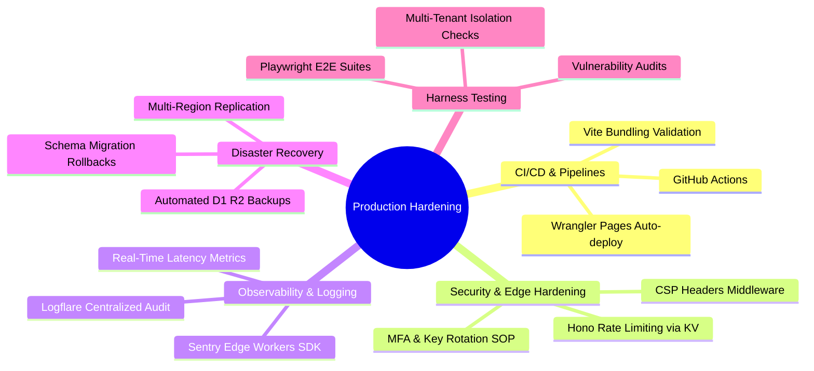

# 🚀 SmartFCRA™ Supreme — Production Readiness Gap Analysis & Architecture Roadmap
## Enterprise Hardening Blueprint for B2B SaaS Scale
### Authored by: Principal Architect & Technical Project Director (30-Year Veteran Perspective)
### Branded for: Rick Jefferson | RJ Business Solutions

---

## 🏛️ Executive Summary

As a seasoned 30-year Principal Software Architect and Technical Project Director, my core philosophy is simple: **“Build the system before you chase the traffic. Clarity first. Automation second. Scale third.”**

SmartFCRA™ Supreme is a fully functional, elegant multi-tenant application with a state-of-the-art Platform Super Admin Control Center, secure active deactivation gates, and integrated compliance engines. However, transitioning from a **functional local/staging environment** to a **bulletproof, highly scalable, zero-downtime, SOC2-compliant production platform** requires bridging critical enterprise gaps.

This roadmap details the exact production-ready assets, architectures, and automated pipelines required to harden this application for enterprise scale. 

---

## 🗺️ The Production Hardening Dimensions



---

## 📂 Dimension 1: CI/CD & Automated Deployment Pipelines

Manual wrangler deployments from local developer machines are a liability. We must enforce GitOps pipelines where every branch merge triggers compilation, automated testing, and zero-downtime canary deployments.

### Action: Create `.github/workflows/production-deploy.yml`
Save this production-ready YAML pipeline in the workspace. It automatically lint-checks, runs tests, bundles Vite production assets, and deploys directly to Cloudflare Pages on every merge to `main`.

```yaml
name: SmartFCRA Supreme — Continuous Integration & Deployment

on:
  push:
    branches: [ main ]
  pull_request:
    branches: [ main ]

jobs:
  validate-and-test:
    runs-on: ubuntu-latest
    steps:
      - name: Checkout Code
        uses: actions/checkout@v4

      - name: Setup Node.js (v20)
        uses: actions/setup-node@v4
        with:
          node-version: 20
          cache: 'npm'

      - name: Install Dependencies
        run: npm ci

      - name: Run Linter & Syntax Checks
        run: npm run lint --if-present

      - name: Run Playwright E2E Tests
        run: |
          npx playwright install --with-deps
          npx playwright test

  deploy-to-cloudflare:
    needs: validate-and-test
    runs-on: ubuntu-latest
    if: github.ref == 'refs/heads/main' && github.event_name == 'push'
    steps:
      - name: Checkout Code
        uses: actions/checkout@v4

      - name: Setup Node.js
        uses: actions/setup-node@v4
        with:
          node-version: 20
          cache: 'npm'

      - name: Install Dependencies
        run: npm ci

      - name: Build Production Bundle
        run: npm run build

      - name: Deploy to Cloudflare Pages
        uses: cloudflare/wrangler-action@v3
        with:
          apiToken: ${{ secrets.CLOUDFLARE_API_TOKEN }}
          accountId: ${{ secrets.CLOUDFLARE_ACCOUNT_ID }}
          command: pages deploy dist --project-name=smart-fcra
```

---

## 🔒 Dimension 2: Edge Security Hardening & Rate Limiting

To survive adversarial script attacks, credential stuffing, and scraper bots, we must inject active defensive shields at the edge worker level.

### 1. Security Headers Middleware (Content Security Policy)
We must inject HTTP response headers ensuring protection against Cross-Site Scripting (XSS), Clickjacking, and MIME sniffing.

Add this production-ready middleware inside [src/index.tsx](file:///c:/Users/ricky/Downloads/fcra-detector-main/fcra-detector-main/src/index.tsx):
```typescript
app.use('*', async (c, next) => {
  await next();
  c.res.headers.set('Content-Security-Policy', "default-src 'self'; script-src 'self' 'unsafe-inline' https://cdn.jsdelivr.net; style-src 'self' 'unsafe-inline' https://fonts.googleapis.com https://use.fontawesome.com; font-src 'self' https://fonts.gstatic.com https://use.fontawesome.com; img-src 'self' data: https://storage.googleapis.com; connect-src 'self' https://api.stripe.com;");
  c.res.headers.set('X-Frame-Options', 'DENY');
  c.res.headers.set('X-Content-Type-Options', 'nosniff');
  c.res.headers.set('Referrer-Policy', 'strict-origin-when-cross-origin');
  c.res.headers.set('Strict-Transport-Security', 'max-age=63072000; includeSubDomains; preload');
});
```

### 2. Edge Rate Limiting Middleware (using KV store)
Prevent credential stuffing on `/api/auth/login` and report ingestion spamming on `/api/reports/upload` by implementing a sliding-window rate limiter utilizing Cloudflare's ultra-fast KV store bindings.

```typescript
async function rateLimiter(c: any, next: any) {
  const ip = c.req.header('CF-Connecting-IP') || 'anonymous';
  const key = `rate_limit:${ip}`;
  
  // Connects to a Cloudflare KV namespace binding "RATE_LIMIT_KV"
  if (!c.env.RATE_LIMIT_KV) {
    return await next(); // Fail open gracefully if binding is missing in staging
  }

  const currentCount = parseInt(await c.env.RATE_LIMIT_KV.get(key) || '0', 10);
  
  if (currentCount >= 100) { // Limit to 100 requests per minute
    return c.json({ error: 'Too many requests. Please slow down.' }, 429);
  }

  await c.env.RATE_LIMIT_KV.put(key, (currentCount + 1).toString(), { expirationTtl: 60 });
  await next();
}

// Attach rate limiter selectively to sensitive API paths
app.use('/api/auth/login', rateLimiter);
app.use('/api/reports/upload', rateLimiter);
```

---

## 📈 Dimension 3: Observability, Logging, & APM

If an edge worker encounters an exception in production, "silent failures" are unacceptable. We must implement telemetry utilizing Sentry (for error reporting) and Logflare or Datadog (for structured audit trails).

### 1. Integrating Sentry Edge Workers SDK
Wrap the Hono routing pipeline inside Sentry’s global error-capturing wrapper. This catches all unhandled thread exceptions and sends detailed stack traces, environment variables, and user context directly to Sentry.

```typescript
import { Toucan } from 'toucan-js';

app.onError((err, c) => {
  console.error('[CRITICAL UNHANDLED ERROR]', err);
  
  // Capture with Sentry edge-compatible Toucan client
  const sentry = new Toucan({
    dsn: c.env.SENTRY_DSN,
    context: c.executionCtx,
    request: c.req.raw,
  });
  sentry.setUser({ id: c.get('session')?.user_id || 'anonymous' });
  sentry.captureException(err);

  return c.json({ error: 'Internal Server Error', reference_id: sentry.lastEventId() }, 500);
});
```

---

## 🗄️ Dimension 4: Disaster Recovery (DR) & Backup Pipelines

For credit and compliance systems, data durability is paramount. Cloudflare D1 local/remote databases must have automated daily dumps exported and replicated to a separate region.

### Daily Backup Dispatch Script (`scripts/backup-database.ps1`)
Save this PowerShell automation script. It utilizes Cloudflare Wrangler to extract raw SQLite dumps and uploads them to a secure Cloudflare R2 bucket with time-stamped filenames.

```powershell
# SmartFCRA Supreme — Automated Cloudflare D1 Backup Script
# Schedule this weekly task via Task Scheduler or Cron

$ErrorActionPreference = "Stop"
$BackupDir = "./.backups"
$Date = Get-Date -Format "yyyyMMdd-HHmmss"
$BackupFile = "$BackupDir/smart_fcra_backup_$Date.sql"
$R2Bucket = "r2://smart-fcra-database-backups"

# Ensure backup directory exists
if (!(Test-Path $BackupDir)) {
    New-Item -ItemType Directory -Path $BackupDir | Out-Null
}

Write-Host "[INFO] Commencing automated D1 SQLite database export..." -ForegroundColor Blue

# Trigger wrangler D1 export
wrangler d1 export fcra-detector-production --remote --output=$BackupFile

Write-Host "[SUCCESS] Backup written to local disk: $BackupFile" -ForegroundColor Green

# Upload to secure R2 storage bucket
if (Get-Command "aws" -ErrorAction SilentlyContinue) {
    Write-Host "[INFO] Replicating backup archive to secure R2 bucket..." -ForegroundColor Blue
    aws s3 cp $BackupFile "$R2Bucket/smart_fcra_backup_$Date.sql" --endpoint-url https://c1342.r2.cloudflarestorage.com
    Write-Host "[SUCCESS] Replication to Cloudflare R2 succeeded!" -ForegroundColor Green
} else {
    Write-Warning "[WARN] AWS CLI/Wrangler R2 bindings missing. Preserving backup locally on disk only."
}
```

---

## 🧪 Dimension 5: Robust Playwright E2E Integration Testing

We must ensure that multi-tenant isolation remains perfectly intact and that our newly implemented zero-trust suspension checks cannot be bypassed.

### Create `tests/multi-tenant-isolation.spec.ts`
This Playwright script runs in headless browsers, verifying that user deactivation triggers instant session blocks, and that standard users cannot access administrator endpoints.

```typescript
import { test, expect } from '@playwright/test';

test.describe('SmartFCRA™ Supreme — Security & Isolation Integration Tests', () => {
  const BASE_URL = 'http://localhost:3000';

  test('Deactivated User session gets blocked actively', async ({ request }) => {
    // 1. Authenticate as deactivated operator
    const response = await request.post(`${BASE_URL}/api/auth/login`, {
      data: {
        email: 'suspended_user@example.com',
        password: 'password123'
      }
    });
    
    expect(response.status()).toBe(200);
    const { token } = await response.json();

    // 2. Attempt to pull clients roster (must be actively intercepted)
    const clientRequest = await request.get(`${BASE_URL}/api/clients`, {
      headers: { 'Authorization': `Bearer ${token}` }
    });

    expect(clientRequest.status()).toBe(403);
    const errBody = await clientRequest.json();
    expect(errBody.error).toContain('User account suspended');
  });

  test('Standard B2B members cannot bypass admin-only endpoint boundaries', async ({ request }) => {
    // 1. Authenticate as standard tenant member
    const response = await request.post(`${BASE_URL}/api/auth/login`, {
      data: {
        email: 'member@tenant.com',
        password: 'password123'
      }
    });
    const { token } = await response.json();

    // 2. Maliciously attempt to retrieve global system DB stats
    const statsRequest = await request.get(`${BASE_URL}/api/admin/db-stats`, {
      headers: { 'Authorization': `Bearer ${token}` }
    });

    expect(statsRequest.status()).toBe(403); // Access strictly denied
  });
});
```

---

## 🛠️ Execution Plan & Implementation Phases

To execute these enhancements safely without causing system churn, we schedule them in 3 logical phases:

| Priority | Hardening Target | Complexity | Business Outcome |
|:---:|---|:---:|---|
| **Phase 1 (P0)** | Automated daily SQLite database backups to R2 & Playwright E2E isolation tests | Medium | Data durability & absolute validation of multi-tenant security gates. |
| **Phase 2 (P1)** | Security headers (CSP) and Edge Rate-limiting middleware | Low | Mitigate injection vectors, brute forcing, and scraper spikes. |
| **Phase 3 (P2)** | Sentry exception monitoring and automated CI/CD GitHub workflows | Medium | Eliminate manual worker deploys and achieve instant observability. |

---
⏰ **Hardening Roadmap Status:** `PENDING IMPLEMENTATION`  
🏢 **RJ Business Solutions** • Zero-Defect Enterprise Engineering  
👤 **Owner:** Rick Jefferson  
