# Smart FCRA — RJ Business Solutions Master Platform Guide

## The Complete Platform-Owner Operating Manual & Ultimate Support Reference

**Platform:** Smart FCRA — multi-tenant credit repair CRM, FCRA/FDCPA/ECOA/Metro2 dispute-letter engine, compliance automation system, and B2B SaaS control plane
**This guide covers:** The full **RJ Business Solutions** platform-owner (super_admin) view — every menu item, every screen, every button — including the **six owner-only "Platform Command Center" sections that no tenant, client, or licensed business ever sees.**
**Live production URL:** https://smartfcra.com
**Plan shown throughout this guide:** Enterprise (all modules unlocked, unlimited AI usage)
**Brand:** Smart FCRA presented by RJ Business Solutions — *"Empowering Generational Wealth"*

---

## Who This Guide Is For

This is the **master reference document** for RJ Business Solutions staff, support agents, trainers, and platform administrators. It documents the platform exactly as the **platform owner (super_admin role)** experiences it — the highest privilege level in Smart FCRA. If you support licensed credit repair businesses (tenants) who run their own branded instance of Smart FCRA (like Positive Money Financial Services), you will recognize most of the operator-facing screens from their own manual. This guide goes further: it also documents the **B2B command center** RJ Business Solutions uses to create, license, monitor, and support every tenant organization on the platform.

Use this guide to:
- Train new RJ Business Solutions support and success staff
- Answer "how do I…" and "what does this screen do" questions from any team member
- Understand exactly what data and controls exist at the platform-owner level vs. the tenant level
- Troubleshoot tenant issues by knowing what the underlying system actually shows an admin
- Onboard new employees to the full architecture of the business

---

## Table of Contents

**Part 1 — Orientation**
1. [How Smart FCRA Is Organized](#1-how-organized)
2. [Logging In & Roles](#2-logging-in)

**Part 2 — The Platform Command Center (Owner-Only — No Tenant Can See These)**
3. [Tenants & Software — The B2B Control Room](#3-tenants-software)
4. [Founder OS Suite — Legal Document Drafting Engine](#4-founder-os)
5. [Sales Tools — Outbound Sales Cockpit](#5-sales-tools)
6. [Brand Library — Marketing & Lead Capture](#6-brand-library)
7. [Demo Signups — Pipeline & Conversion Tracking](#7-demo-signups)
8. [Product Map — The Living Feature Index](#8-product-map)
9. [ROI Calculator — Enterprise Value Modeling](#9-roi-calculator)

**Part 3 — Day-to-Day Operator Workflow (Every Tenant Sees These Too)**
10. [Executive Overview](#10-executive-overview)
11. [Client Management](#11-client-management)
12. [Violation Review QA](#12-violation-review-qa)
13. [Dashboard](#13-dashboard)
14. [Reports (Credit Reports)](#14-reports)
15. [Violations](#15-violations)
16. [Documents](#16-documents)
17. [Compliance Hub](#17-compliance-hub)
18. [Compliance OS](#18-compliance-os)
19. [Integration Hub](#19-integration-hub)
20. [Support Center](#20-support-center)
21. [Help & Guide](#21-help-guide)
22. [Campaigns](#22-campaigns)
23. [Mailing Campaigns](#23-mailing-campaigns)
24. [Tradelines](#24-tradelines)
25. [Team Management](#25-team)
26. [Security & Devices](#26-security-devices)
27. [Settings](#27-settings)
28. [AI Studio](#28-ai-studio)
29. [Billing & Subscription](#29-billing)
30. [Legal & Compliance](#30-legal)

**Part 4 — Reference**
31. [Quick Reference / Cheat Sheet](#31-cheat-sheet)
32. [Getting Help & Escalation Paths](#32-getting-help)

---

# Part 1 — Orientation

## 1. How Smart FCRA Is Organized {#1-how-organized}

Smart FCRA is a **multi-tenant SaaS platform**. That means one codebase and one database serve many separate businesses ("tenants" or "organizations"), each isolated from the others by an `org_id`, while RJ Business Solutions — the company that builds and operates Smart FCRA — sits above all of them as the platform owner.

There are three layers to understand:

| Layer | Who's in it | What they see |
|---|---|---|
| **Platform Owner (RJ Business Solutions)** | The `org_platform_master` organization, role `super_admin` | Everything — every tenant, every account, every dollar, every log line, **plus** the six owner-only Platform Command Center sections in Part 2 of this guide |
| **Tenant / Licensed Business** (e.g. Positive Money Financial Services, Ready Check Credit LLC) | Business owners and their staff, roles `admin`/`staff` | Their own organization's data only — clients, reports, violations, letters, billing, team. They never see other tenants or the Command Center |
| **Client / Consumer** | Individual consumers whose credit is being repaired, role `client` | Only their own case file through the Client Portal |

Every screen in this guide is labeled either **Owner-Only** (Part 2 — visible exclusively to `super_admin` at the platform level) or **Shared Operator View** (Part 3 — the same screen a tenant like Positive Money sees inside their own organization, just scoped to that tenant's data instead of the platform's).

Understanding this distinction is the single most important thing for a support agent: if a tenant asks "why can't I see the Tenants & Software page," the answer is simple — **they aren't supposed to.** That page only exists for RJ Business Solutions.

## 2. Logging In & Roles {#2-logging-in}

### 2.1 Login URL

The platform owner logs in at the root platform domain (https://smartfcra.com). Each licensed tenant instead has a **branded subdomain** (for example `positivemoney.smartfcra.com`) that shows their own logo, colors, and name — but it is the exact same underlying application, simply scoped to that tenant's `org_id`.

### 2.2 Roles in the system

| Role | Scope | Typical user |
|---|---|---|
| `super_admin` | Full platform, all tenants, Command Center | RJ Business Solutions owners/founders |
| `admin` | Full control of one tenant organization | A licensed business's owner (e.g. Positive Money's admin) |
| `staff` | Working access to one tenant's clients/cases | Case workers, dispute specialists, sales/support reps |
| `client` | Their own case only | The consumer whose credit is being repaired |

### 2.3 First login checklist for a new RJ Business Solutions team member

1. Go to https://smartfcra.com and sign in with your assigned email + password
2. You will land on the **Dashboard** (Section 13) scoped to `org_platform_master`
3. Set up **MFA (multi-factor authentication)** immediately — the platform owner account controls every tenant, so this account is the highest-value security target in the whole system
4. Review **Security & Devices** (Section 26) — device/location lock policy applies to your account just like any tenant's
5. Familiarize yourself with the left-hand navigation — Part 2 sections (Tenants & Software, Founder OS, Sales Tools, Brand Library, Demo Signups, Product Map, ROI Calculator) only appear for `super_admin` accounts; everything below that in the nav is the same operator toolkit every tenant uses

### 2.4 Security note on the staff MFA gate

Certain **destructive, mutating admin actions** — triggering a manual backup, preparing/loading demo data, fulfilling a privacy/deletion request, or canceling billing — require a fresh MFA confirmation even if you're already logged in. This is intentional: it protects the handful of actions that could affect live tenant data or billing. Ordinary read-only navigation (viewing any page in this guide, including the Command Center) never requires re-entering MFA. If you ever see an MFA prompt while simply viewing a page, treat it as a bug and escalate — screens should never re-challenge MFA just to be *viewed*.

---

# Part 2 — The Platform Command Center
### Owner-Only — No Tenant, Client, or Licensed Business Can See These Sections

The following seven sections exist **only** for the `org_platform_master` / `super_admin` account. They are how RJ Business Solutions runs the *business* of Smart FCRA — onboarding new tenants, drafting legal/contract paperwork, running outbound sales, capturing marketing leads, tracking demo pipeline, documenting the product, and modeling ROI for prospects. No amount of clicking around as a tenant admin will ever reveal these pages; they are not merely hidden by CSS, they are gated by role at the navigation and route level.

## 3. Tenants & Software — The B2B Control Room {#3-tenants-software}

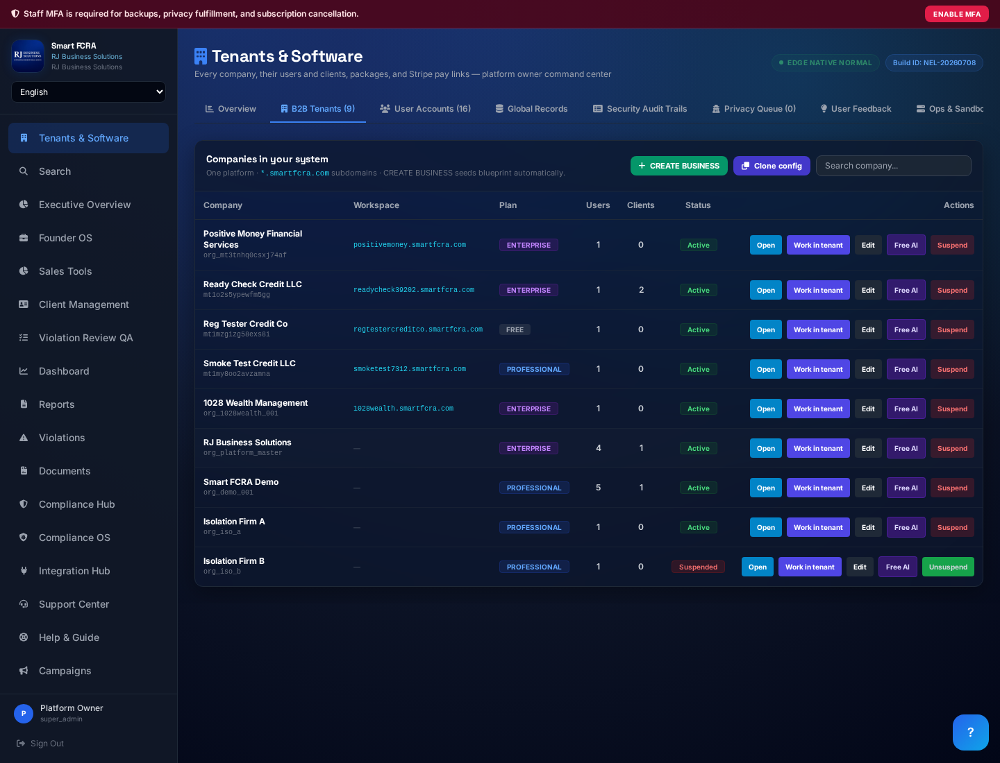

This is the master control room for the entire Smart FCRA business. It is the first place a support agent should go when investigating any tenant-level issue.

**Top tab bar** — the page is organized into eight tabs:

| Tab | What it shows |
|---|---|
| **Overview** | High-level platform health snapshot |
| **B2B Tenants (9)** | Every licensed business running Smart FCRA — the main working view (see below) |
| **User Accounts (16)** | Every individual login across every tenant, platform-wide |
| **Global Records** | Cross-tenant record counts (clients, reports, letters, etc.) |
| **Security Audit Trails** | Login/session telemetry across the whole platform |
| **Privacy Queue (0)** | Pending GDPR/CCPA-style data deletion or export requests awaiting fulfillment |
| **User Feedback** | Feedback submitted from any org's Help & Guide page |
| **Ops & Sandbox** | Scheduled jobs and the demo/sandbox environment controls |

**The B2B Tenants table** (shown in the screenshot) lists every organization on the platform. As of this writing there are nine:

1. **Positive Money Financial Services** — active licensed tenant
2. **Ready Check Credit LLC** — active licensed tenant
3. **Reg Tester Credit Co** — internal regression-testing org
4. **Smoke Test Credit LLC** — internal smoke-testing org
5. **1028 Wealth Management** — active licensed tenant
6. **RJ Business Solutions** (`org_platform_master`) — this is the platform owner's own organization
7. **Smart FCRA Demo** (`org_demo_001`) — the public interactive demo sandbox
8. **Isolation Firm A** — internal tenant-isolation test org
9. **Isolation Firm B** (Suspended) — internal tenant-isolation test org, deliberately suspended to verify suspension logic works

Each row shows the organization's plan tier, status, and quick actions. Two important buttons sit above the table:

- **CREATE BUSINESS** — provisions a brand-new tenant organization from scratch (new `org_id`, default branding, starter plan). This is the very first step of onboarding a new licensed business — see `docs/TENANT_ONBOARDING_SOP.md` for the full technical provisioning checklist that follows (Cloudflare Pages routing, D1 isolation, environment variables, Stripe tier setup, Lob mail account).
- **Clone config** — duplicates an existing tenant's configuration (branding, letter templates, integrations) into a new org, useful for onboarding a business that wants a similar setup to an existing client.

> **Support tip:** If a tenant reports "my dashboard looks wrong" or "I can't see a client," the fastest diagnostic is to open this page, find their row in B2B Tenants, and confirm their `org_id`, plan, and status are what you expect. If their org shows `Suspended`, that explains everything — see `docs/SYSTEM_ADMIN_SOP.md` for how tenant-wide suspension (`settings.suspended = true`) versus individual user deactivation (`is_active = 0`) differ.

## 4. Founder OS Suite — Legal Document Drafting Engine {#4-founder-os}

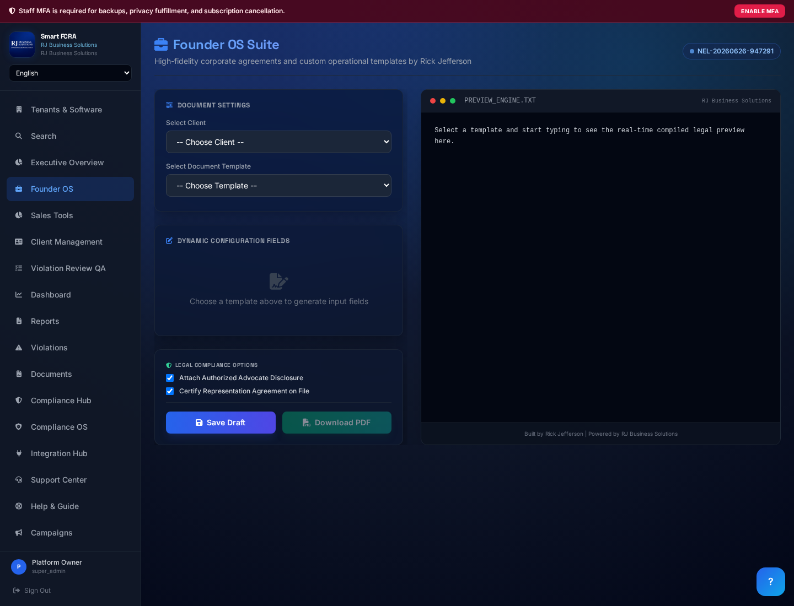

Founder OS is RJ Business Solutions' internal legal/contract document generator — separate from the client-facing dispute letter engine (Documents, Section 16). It is used to draft the paperwork that governs the *business relationship* itself: tenant licensing agreements, service contracts, NDAs, and similar founder-level legal documents.

The screen has three working panels:

- **Document Settings** — dropdowns to select which client/tenant the document is for and which template to start from
- **Dynamic Configuration Fields** — fields that get merged into the template (names, dates, dollar amounts, terms) so the same template can be reused for many deals
- **Legal Compliance Options** — a pair of checkboxes (both checked in the screenshot) that toggle standard legal boilerplate clauses on or off, depending on the deal

Once configured, two actions are available: **Save Draft** (keeps the work-in-progress without finalizing) and **Download PDF** (renders the finished document). A live **preview terminal** on the right (`PREVIEW_ENGINE.TXT`) shows the document rendering in real time as fields are edited, so you can see exactly what will be produced before downloading.

> **Support tip:** Founder OS is for RJ Business Solutions' own contracts — it is not where tenants generate their client dispute letters. If someone asks about generating a dispute letter, direct them to Section 16 (Documents) instead.

## 5. Sales Tools — Outbound Sales Cockpit {#5-sales-tools}

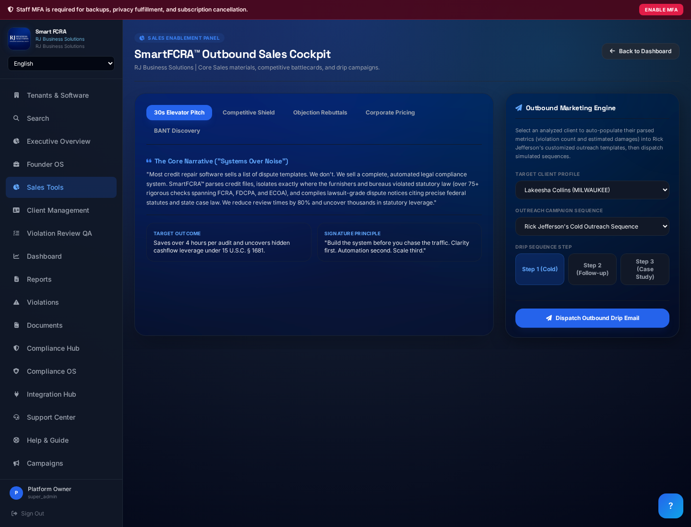

Branded as the **SmartFCRA™ Outbound Sales Cockpit**, this page equips RJ Business Solutions' sales team with everything needed to sell the platform to new prospective tenants. It is organized as a tab bar:

| Tab | Purpose |
|---|---|
| **30s Elevator Pitch** *(default)* | A tight, memorized-ready pitch script for cold outreach |
| **Competitive Shield** | Talking points comparing Smart FCRA favorably against competing credit-repair software |
| **Objection Rebuttals** | Pre-written responses to the most common sales objections |
| **Corporate Pricing** | The enterprise/corporate pricing structure for larger prospects |
| **BANT Discovery** | Budget / Authority / Need / Timeline qualifying questions for discovery calls |

Below the tabs, the **Core Narrative** panel holds the platform's central value-proposition quote, alongside **Target Outcome** and **Signature Principle** cards that keep every salesperson's pitch consistent.

At the bottom, the **Outbound Marketing Engine** panel lets a sales rep pick a client profile, choose a campaign sequence and a specific drip step, and click **Dispatch** to fire off the next touch in an automated outbound sequence — turning this page into both a training script library and an actual outreach trigger.

> **Support tip:** This page is a sales enablement tool, not a customer support tool. If a prospect or lead needs a demo, see Section 7 (Demo Signups) for where those requests land.

## 6. Brand Library — Marketing & Lead Capture {#6-brand-library}

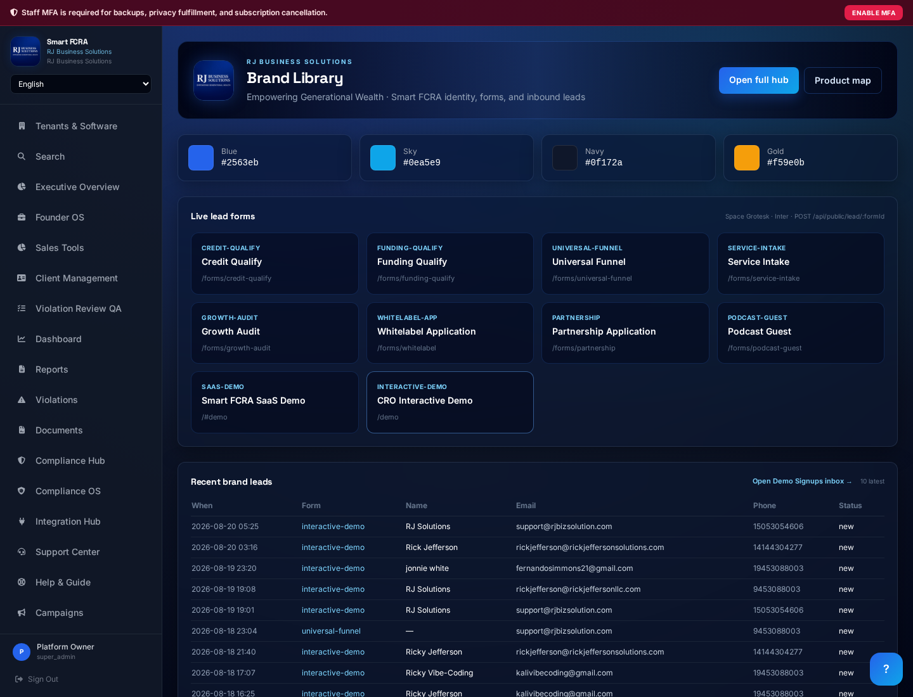

The Brand Library serves two purposes: it is the canonical source of RJ Business Solutions' visual brand tokens, and it hosts a grid of ten live lead-capture forms used across marketing channels.

**Brand colors** (also used to theme this very guide's PDF export):

| Token | Hex |
|---|---|
| Blue | `#2563eb` |
| Sky | `#0ea5e9` |
| Navy | `#0f172a` |
| Gold | `#f59e0b` |

Primary fonts are **Space Grotesk** (headings) and **Inter** (body text). The product is always referred to as **"Smart FCRA presented by RJ Business Solutions"** with the tagline **"Empowering Generational Wealth."**

Below the brand tokens, a grid of **ten live lead forms** is displayed — these are the actual embeddable forms used on landing pages, partner sites, and campaigns to capture prospect information. A **Recent brand leads** table shows the latest submissions across all ten forms in one place, so marketing can see everything coming in without checking ten separate form dashboards.

> **Support tip:** If someone from marketing asks "where do our website leads go," this page — plus the Leads panel inside Compliance OS (Section 18) — is the answer.

## 7. Demo Signups — Pipeline & Conversion Tracking {#7-demo-signups}

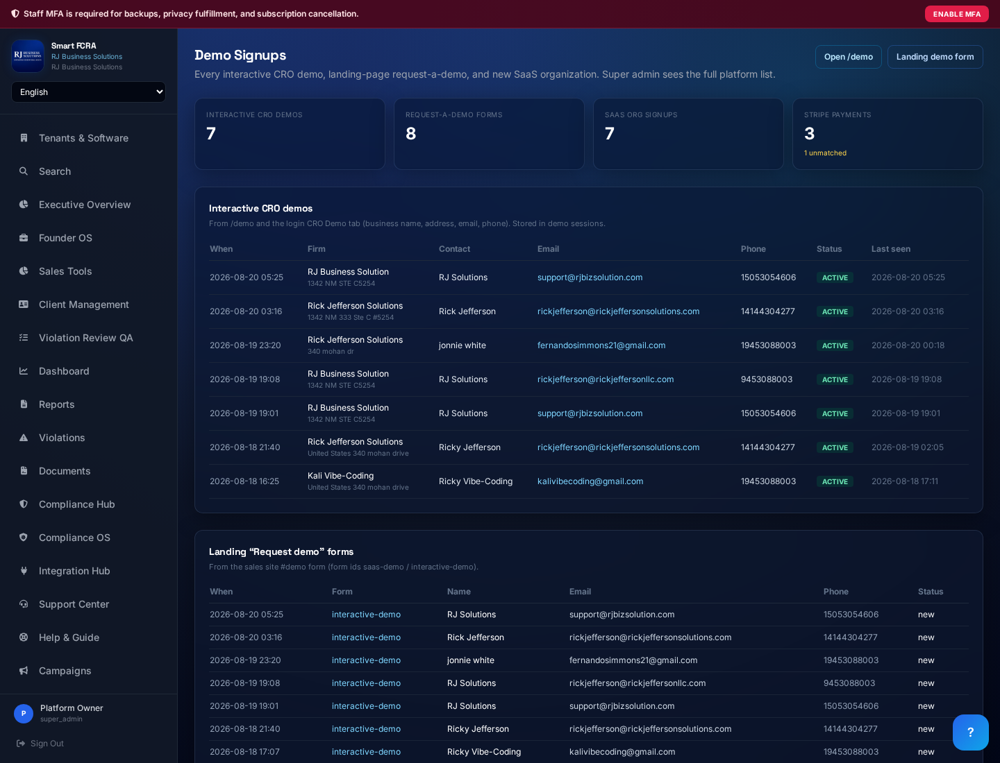

This page tracks the entire top-of-funnel pipeline: everyone who has requested or started a demo of Smart FCRA, and everyone who has actually signed up for a paid SaaS account. Four stat cards summarize the funnel:

- **Interactive CRO Demos** — count of self-serve, click-through product demos started (7 in the current data)
- **Request-a-Demo Forms** — count of prospects who filled out a "request a demo" form for a human-led walkthrough (8)
- **SaaS Org Signups** — count of organizations that actually completed signup (7)
- **Stripe Payments** — payments received, with a callout for any unmatched payment that couldn't be automatically linked to a signup (3 total, 1 unmatched)

Below the stat cards, two tables give the full detail:

1. **Interactive CRO demos table** — every self-serve demo session, all showing `ACTIVE` status in the current data, with columns for contact info and demo start time
2. **Landing Request demo forms table** — every "request a demo" form submission, useful for the sales team to follow up on warm leads

> **Support tip: this page had a bug.** Earlier, a backend MFA-gate defect briefly caused this page (and the Tenants & Software page) to render the wrong content ("Organization Settings") instead of their real data. That bug has been **fixed and deployed** (see the Security note in Section 2.4 and the technical appendix at the end of this guide). If this page is ever seen showing anything other than the demo/signup tables described above, treat it as a regression and escalate immediately.

## 8. Product Map — The Living Feature Index {#8-product-map}

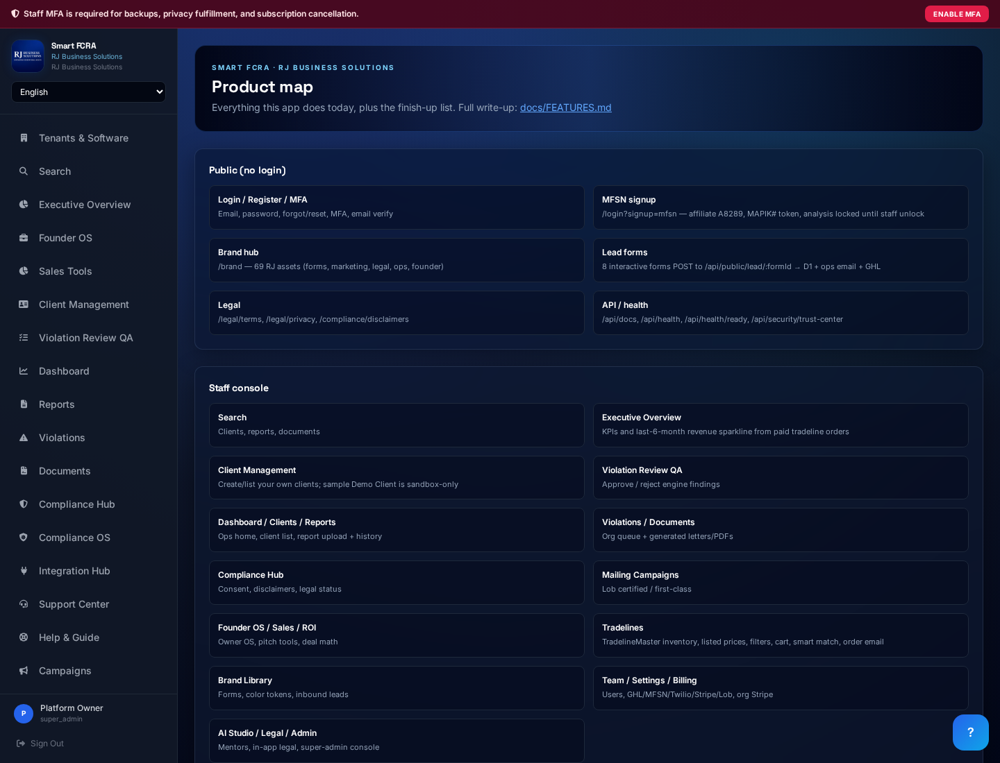

The Product Map is a self-documenting index of the entire platform, linking directly to the technical `docs/FEATURES.md` reference file that engineering maintains. It is split into two halves:

- **Public (no login) section** — cards describing everything a visitor can see before signing in: the marketing site, the public demo, request-a-demo forms, etc.
- **Staff console section** — ten grouped feature cards covering every module behind login: client management, the violation/dispute engine, documents, compliance, mailing, tradelines, AI Studio, team, billing, and the admin/Command Center tools described in this very guide

> **Support tip:** When a new feature ships, this is the page that should be checked first to confirm it has been indexed. If a support agent can't find a feature described anywhere, the Product Map (and `docs/FEATURES.md` behind it) is the authoritative place to look before assuming it doesn't exist.

## 9. ROI Calculator — Enterprise Value Modeling {#9-roi-calculator}

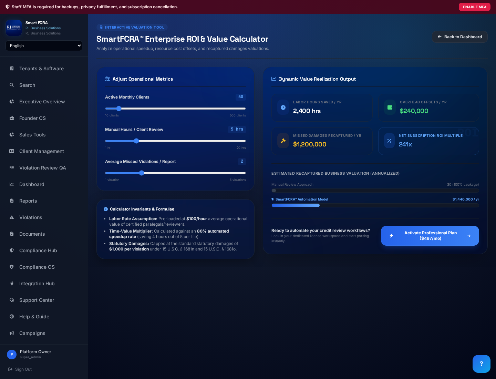

This is a sales and customer-success tool for quantifying the value Smart FCRA delivers to a credit repair business, used both to close new enterprise deals and to justify plan upgrades for existing tenants.

Three adjustable sliders drive the model:

- **Active Monthly Clients** (default 50)
- **Manual Hours per Review** (default 5 hrs)
- **Missed Violations per Report** (default 2)

Based on those inputs, the **Dynamic Value Output** panel calculates:

- **Labor Hours Saved** — 2,400 hrs in the default scenario
- **Overhead Offsets** — $240,000
- **Missed Damages Recaptured** — $1,200,000 (the dollar value of FCRA violations that would otherwise go undetected without the platform's automated violation-scanning engine)
- **Net ROI Multiple** — 241x

A **Calculator Invariants** box documents the underlying assumptions so the numbers can be defended in a sales conversation, and a valuation comparison chart visualizes the output against the cost of the plan. An **Activate Professional Plan** call-to-action sits at the bottom, letting a rep move a convinced prospect straight into checkout.

> **Support tip:** The numbers here are illustrative modeling, not a guarantee — never present the output of this calculator to a client or prospect as a promised result. This aligns with the platform-wide **Golden Rule: never promise an outcome** (see Section 20, Support Center, and `docs/CUSTOMER_SERVICE_COMPLIANCE_PLAYBOOK.md`).

---

# Part 3 — Day-to-Day Operator Workflow
### Shared Operator View — Every Tenant (and RJ Business Solutions Staff) Uses These Screens

The remaining screens are the working core of Smart FCRA: the tools any licensed business — and RJ Business Solutions itself, when working its own `org_platform_master` organization or supporting a tenant — uses every day to manage clients, run credit report analysis, generate legal dispute letters, and stay compliant. If you've read the Positive Money Financial Services user manual, this part will look familiar — it is the same screens, just shown here from the RJ Business Solutions organization's own data.

## 10. Executive Overview {#10-executive-overview}

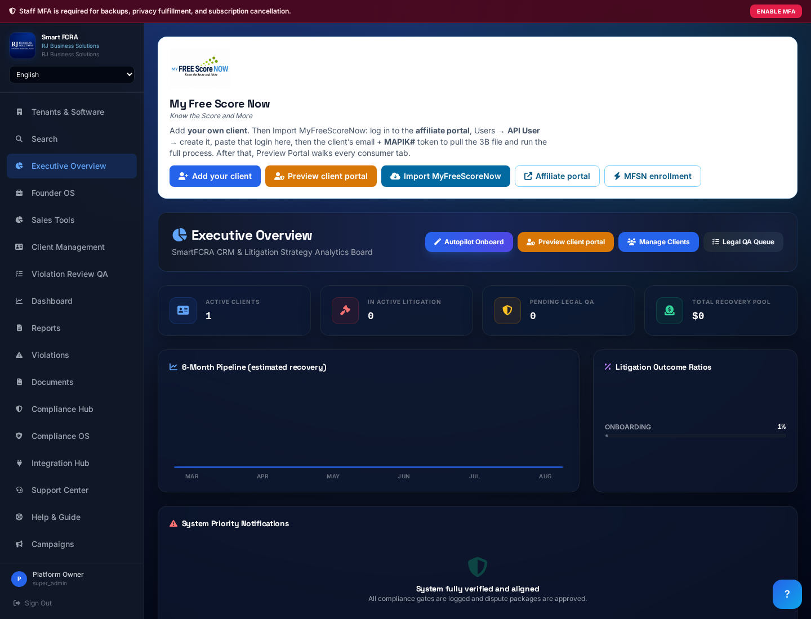

The Executive Overview is a high-level, leadership-oriented summary of the organization's book of business — designed for a quick "how are we doing" glance rather than deep case work.

At the very top, an **MFSN integration banner** provides one-click actions: **Add client**, **Preview portal**, **Import MFSN**, **Affiliate portal**, and **MFSN enrollment** — MFSN (MyFreeScoreNow) is the platform's primary credit-report data source integration, and these buttons let staff quickly pull a new client's data in from it.

The header row itself repeats the most common actions — **Autopilot Onboard**, **Preview**, **Manage Clients**, **Legal QA Queue** — so a manager never has to leave this page to kick off routine work.

Four stat cards summarize the organization at a glance:

- **Active Clients** (1 in the current data)
- **In Litigation** (0)
- **Pending QA** (0)
- **Recovery Pool** ($0 — the running total of estimated FCRA statutory + actual damages identified across all active cases)

Below the stat cards, a **6-Month Pipeline** chart visualizes new client intake and progress over time, and a **Litigation Outcome Ratios** panel shows the historical mix of case outcomes. A **System Priority Notifications** panel surfaces anything that needs a manager's attention right now (overdue QA reviews, stalled cases, compliance flags).

## 11. Client Management {#11-client-management}

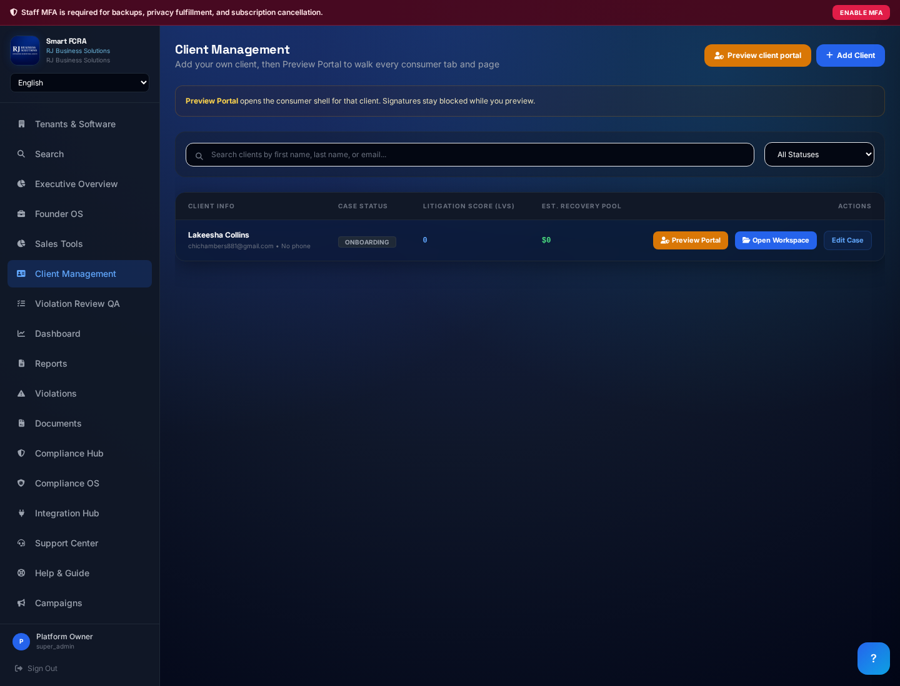

This is the day-to-day client roster. A banner at the top explains the **Preview Portal** feature — the ability for staff to see exactly what a given client sees when they log into their own portal, which is invaluable both for training and for troubleshooting a client's "I can't find X" complaint.

Below the banner sits a **search box** and a **status filter**, then the client table itself. Each row (in the current data, a single client — Lakeesha Collins) offers three quick actions:

- **Preview Portal** — view the platform exactly as this client sees it
- **Open Workspace** — jump into the full case-working view (reports, violations, documents, notes) for this client
- **Edit Case** — modify the client's core case details (name, contact info, case status, assigned staff)

> **Support tip:** "Preview Portal" is the fastest way to resolve a "the client says they can't see their letter" ticket — open their preview and look yourself before escalating anything.

## 12. Violation Review QA {#12-violation-review-qa}

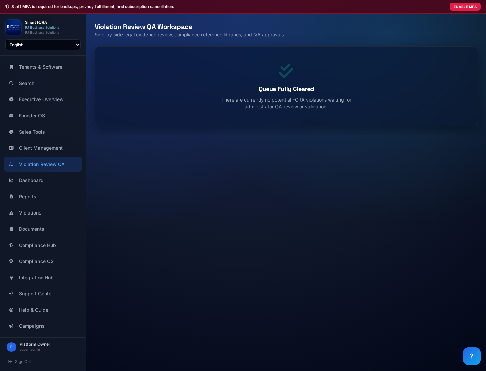

This is the quality-assurance checkpoint every AI-detected FCRA/FDCPA/ECOA/Metro2 violation must pass through before a dispute letter can cite it. In the captured screenshot the queue is empty, shown by a large green checkmark and the message **"Queue Fully Cleared — no potential FCRA violations waiting for QA review."**

When violations *are* pending, this page lists each one with the underlying evidence so a qualified reviewer can confirm the violation is real and well-supported before it's used in a legal letter — this human-in-the-loop check is a core part of the platform's "hallucination firewall" design philosophy: AI drafts, but a person verifies before anything goes out the door with legal weight.

## 13. Dashboard {#13-dashboard}

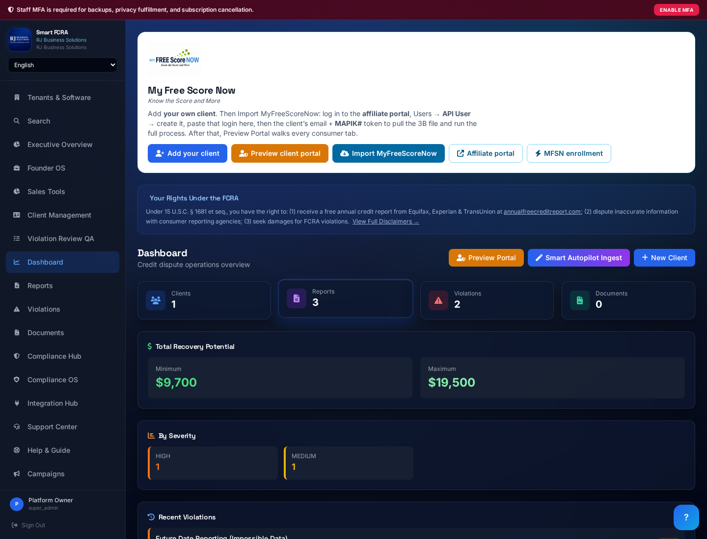

The Dashboard is the default landing page after login and gives the most detailed operational snapshot in the platform. At the top, the same MFSN integration banner appears alongside a boxed **FCRA rights disclaimer** — a reminder of the consumer-protection statute this entire business is built around.

The header offers **Preview Portal**, **Smart Autopilot Ingest** (bulk-import new credit report data), and **New Client** buttons.

Four stat cards give the core numbers:

- **Clients** (1)
- **Reports** (3)
- **Violations** (2)
- **Documents** (0)

A **Total Recovery Potential** figure ($9,700–$19,500 in the current data) estimates the statutory + actual damages available across all detected violations, broken down further by **Severity** (High: 1, Medium: 1). A **Recent Violations** list gives one-click access to the newest findings.

## 14. Reports (Credit Reports) {#14-reports}

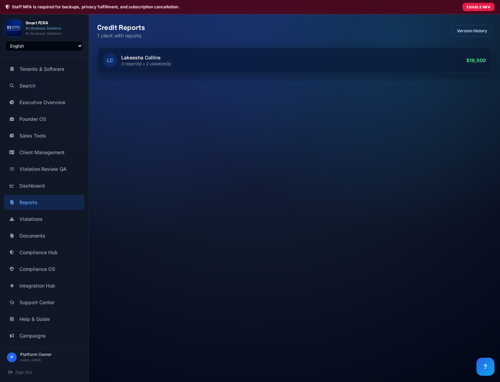

This page lists every credit report ever ingested for the organization's clients, grouped by client. In the current data, the single client (Lakeesha Collins) has three reports on file, which together surfaced two violations worth up to $19,500 in estimated damages. A **Version history** button on each row lets staff compare a client's credit report over time — essential for tracking whether a dispute actually resulted in an item being corrected or removed.

## 15. Violations {#15-violations}

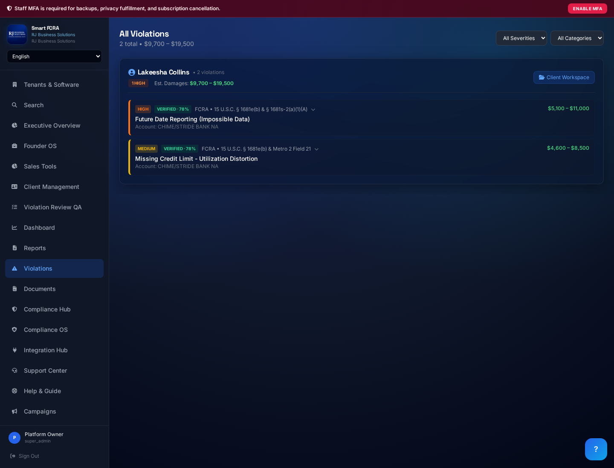

This page is the full, detailed ledger of every violation the engine has detected across all clients — two violations, $9,700–$19,500 in total estimated damages, in the current data. **Severity** and **Category** filters let staff narrow the list (e.g., show only High-severity FCRA violations). Each client's violation card shows the specific statute cited, a plain-language description of the violation, and the associated damage range — this is the same evidence base used to justify every dispute letter generated in Section 16.

## 16. Documents {#16-documents}

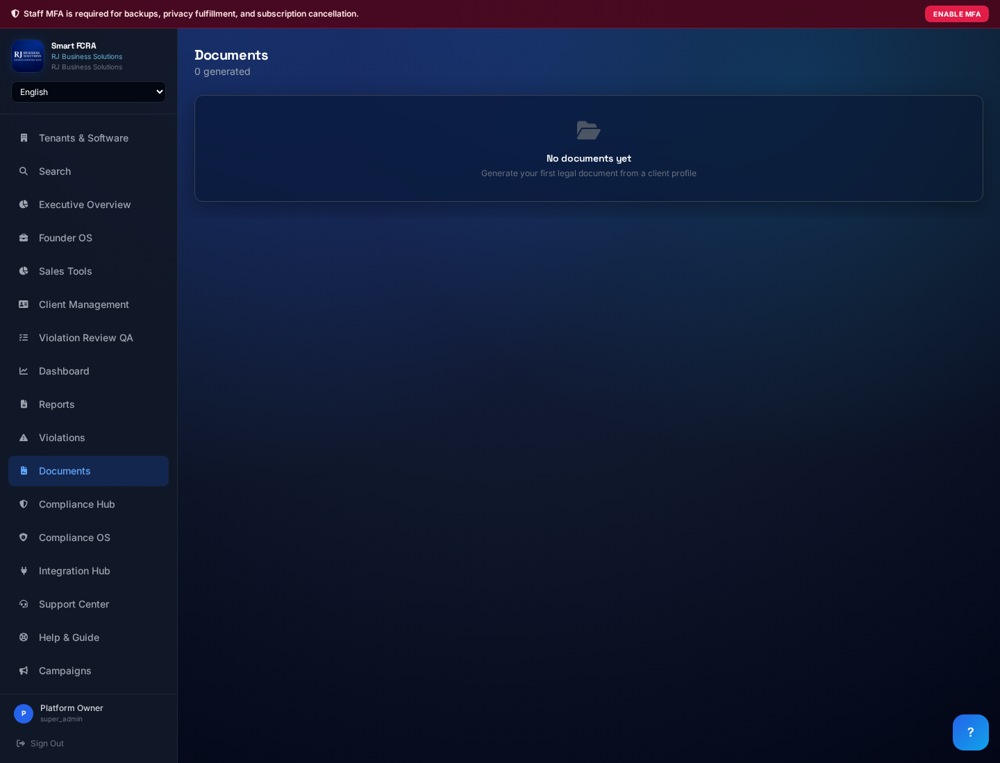

This is the client-facing legal document library — dispute letters, demand letters, and related paperwork generated for a specific client's case (distinct from Founder OS in Section 4, which drafts RJ Business Solutions' own business contracts). In the current data the list is empty, showing the guidance message: **"No documents yet — Generate your first legal document from a client profile."** Documents are generated from within a client's workspace (reached via Client Management → Open Workspace), where the engine offers roughly 45 different letter types spanning FCRA, FDCPA, ECOA, Metro2, state-law, and bankruptcy-related disputes.

## 17. Compliance Hub {#17-compliance-hub}

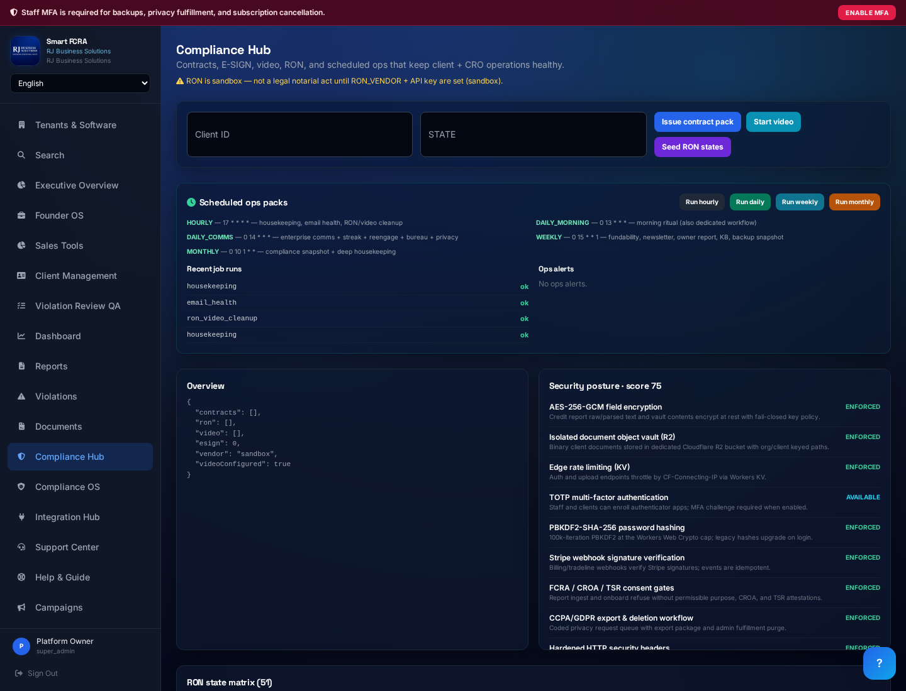

The Compliance Hub is the operational center for contracts, e-signatures, video verification, and Remote Online Notarization (RON). A visible **RON sandbox warning** reminds staff that RON is running in a test/sandbox mode unless explicitly configured for a live state. Staff can enter a **Client ID** and **State**, then **Issue contract pack**, **Start video** (identity/consent video capture), or **Seed RON states** (load the notarization rules for a given state).

Below that, a **Scheduled ops packs** panel lists automated compliance jobs that run on a schedule (hourly, daily, weekly, monthly), each with its own manual "run now" button and a plain-language description of what the job does. A **Recent job runs** table confirms every recent scheduled job completed `ok`.

An **Overview JSON** panel exposes the raw configuration for advanced troubleshooting, and a **Security posture score** of **75/100** is shown with a full checklist of enforced vs. available security controls. Finally, a **RON state matrix** documents notarization rules across all 51 US jurisdictions (50 states + DC).

## 18. Compliance OS {#18-compliance-os}

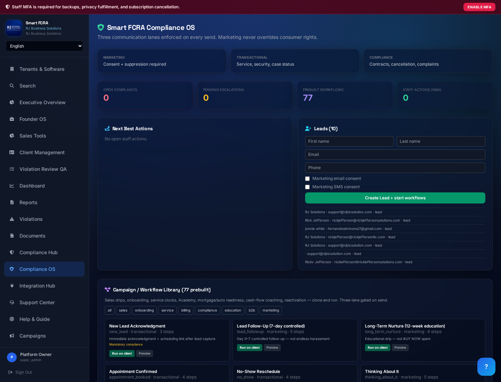

Compliance OS governs all outbound communications through a **three-lane system**: Marketing, Transactional, and Compliance. Separating these lanes is a core regulatory safeguard — marketing messages (promotional) must never be mixed with transactional (service-related) or compliance (legally-required) messages, since each is governed by different consent and opt-out rules (CAN-SPAM, TCPA, etc.).

Stat cards show **Complaints (0)**, **Escalations (0)**, **Prebuilt Workflows (77)**, and **Staff Actions (0)**. A **Leads (10)** panel combines a lead-intake form with a live list of the ten most recent leads. Below that, the **Campaign/Workflow Library** — 77 prebuilt automation workflows organized by category tabs — gives staff ready-made, pre-approved communication sequences (six workflow cards are visible at a glance) rather than requiring anyone to write a new campaign from scratch for common scenarios.

## 19. Integration Hub {#19-integration-hub}

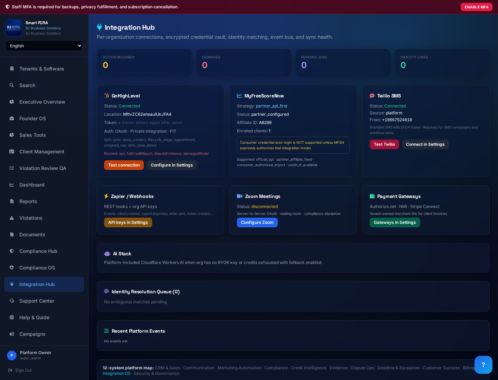

The Integration Hub is where each organization connects its third-party tools. Stat cards at the top (**Action Required 0**, **Degraded 0**, **Pending Jobs 0**, **Identity Links 0**) give an at-a-glance integration health check. Individual cards below cover:

- **GoHighLevel** — CRM/marketing automation
- **MyFreeScoreNow (MFSN)** — primary credit report data source
- **Twilio SMS** — text messaging
- **Zapier / Webhooks** — general automation glue
- **Zoom Meetings** — video calls
- **Payment Gateways** — Stripe and related billing rails

A note on the **AI Stack** explains the free-tier AI provider cascade used platform-wide (see Section 28, AI Studio). An **Identity Resolution Queue** and **Recent Platform Events** feed round out the page, and a footer maps all **12 platform systems** at a glance for quick orientation.

> **Reference:** the full integrations table — including Lob (primary mail vendor) vs. Click2Mail (legacy fallback only), Stripe, Cloudflare Turnstile, Sentry, and Proof (RON) — lives in `docs/FEATURES.md` section 6.

## 20. Support Center {#20-support-center}

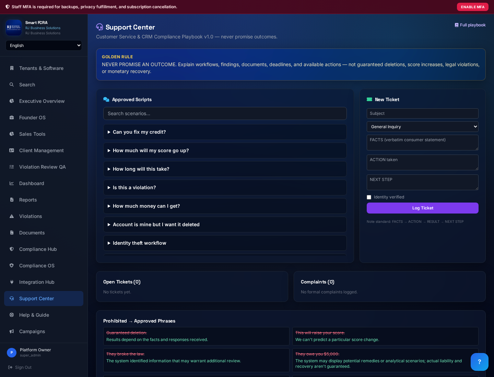

This page hosts the platform's **Customer Service & CRM Compliance Playbook v1.0** — the definitive script and policy library for anyone talking to a client or prospect. A prominent banner states the **Golden Rule: NEVER PROMISE AN OUTCOME** — no representative may ever tell a client or prospect that a specific result (item removed, score increase, case win) is guaranteed.

An **Approved Scripts** panel holds seven expandable scenario scripts covering the most common calls (identity verification, status updates, objection handling, escalations, etc.). Below that sit a **New Ticket** form and counters for **Open Tickets (0)** and **Complaints (0)**. A **Prohibited → Approved Phrases** table is one of the most important training tools on the page — it lists exact phrases staff must never say next to the compliant alternative phrasing to use instead.

> **Reference:** the full playbook — including identity-verification scripts, the five-row objection-handling table, escalation levels 1 through 6, and the QA scorecard weighting (Authentication 15%, Privacy 15%, Accuracy 15%, Compliance 20%, CX 10%, Resolution 10%, Documentation 10%, Escalation 5%) — lives in `docs/CUSTOMER_SERVICE_COMPLIANCE_PLAYBOOK.md`. Every new support hire should read that document in full before taking their first call.

## 21. Help & Guide {#21-help-guide}

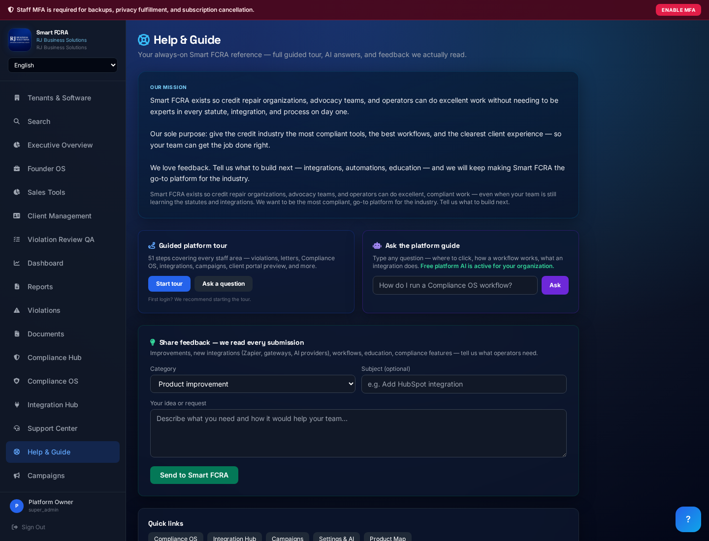

This is the in-app self-service help center. It opens with the company's **Our Mission** statement, followed by a **Guided platform tour** card offering a 51-step interactive walkthrough of the whole application — an excellent first stop for any brand-new user, tenant or staff alike. An **"Ask the platform guide AI"** box lets a user type a plain-language question and get an instant answer. A **Share feedback** form routes directly into the User Feedback tab of the Tenants & Software Command Center page (Section 3) so RJ Business Solutions can see what every tenant is saying. A row of quick links rounds out the page.

## 22. Campaigns {#22-campaigns}

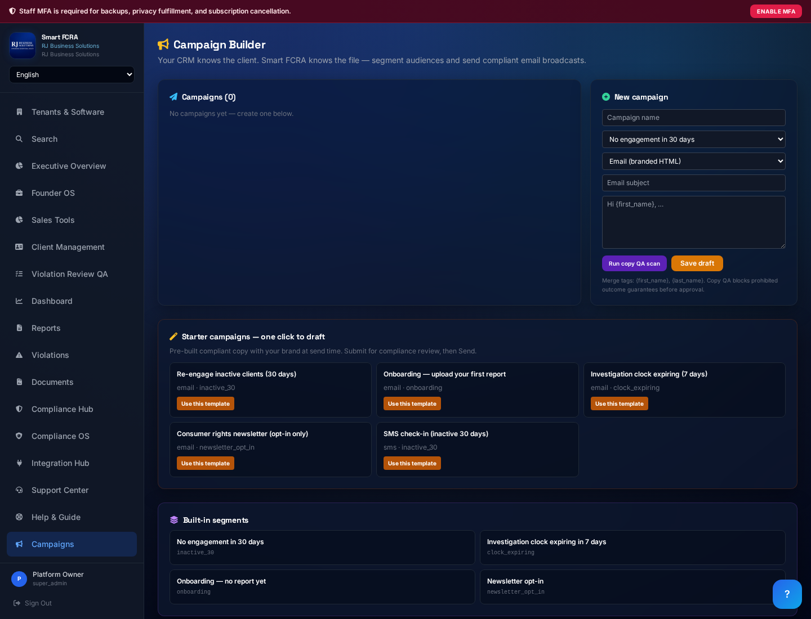

Campaigns is the client-marketing campaign builder — distinct from the internal Sales Tools cockpit (Section 5), which markets *to prospective tenants*; this page markets *to a tenant's own clients* (e.g., referral requests, review requests, re-engagement drips). In the current data, **Campaigns (0)** is empty, but a **New campaign** form is ready to use, and five **Starter campaign templates** plus four **built-in audience segments** are provided so a business can launch its first campaign in minutes without starting from a blank page.

## 23. Mailing Campaigns {#23-mailing-campaigns}

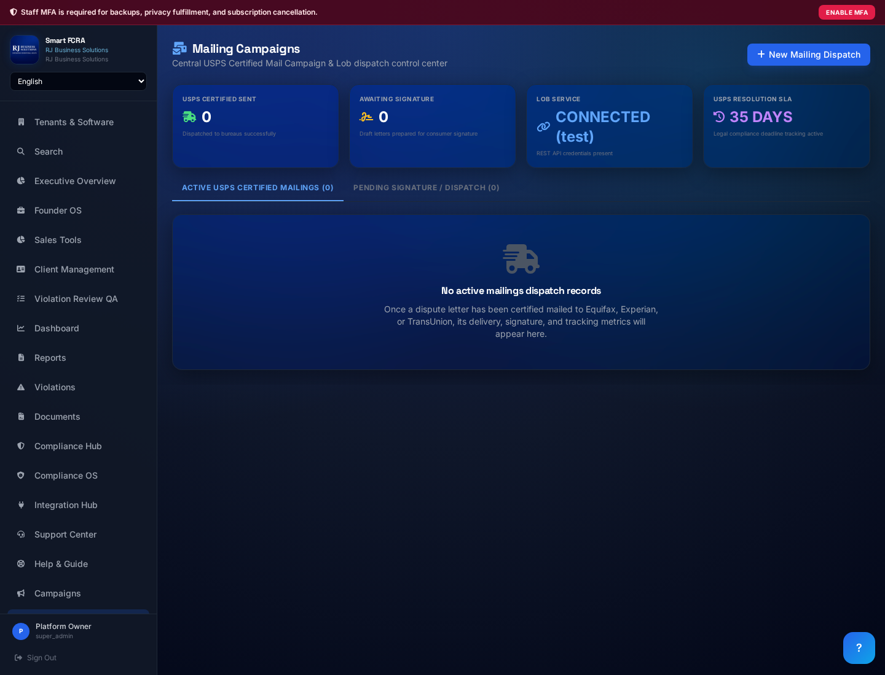

This is the physical-mail dispatch center — the operational hub for sending certified USPS dispute letters through the platform's mail vendor integration (Lob, primary). Stat cards show **USPS Certified Sent (0)**, **Awaiting Signature (0)**, **Lob Service Connected (test mode)**, and a **USPS Resolution SLA of 35 days** — the standard clock the platform tracks for how long a bureau/furnisher has to respond to a certified dispute before an escalation is warranted. **Active** and **Pending** tabs organize outgoing mail by status; the current data shows an empty state on both.

> **Reference:** `docs/TENANT_ONBOARDING_SOP.md` documents the full technical mail-billing flow: the `chargeMailPostage()` function tries four payer sources in order (org wallet → client wallet → org card → comped) before a letter is dispatched, and the exact Lob API JSON structure (`POST https://api.lob.com/v1/letters`) used to place the physical mail order.

## 24. Tradelines {#24-tradelines}

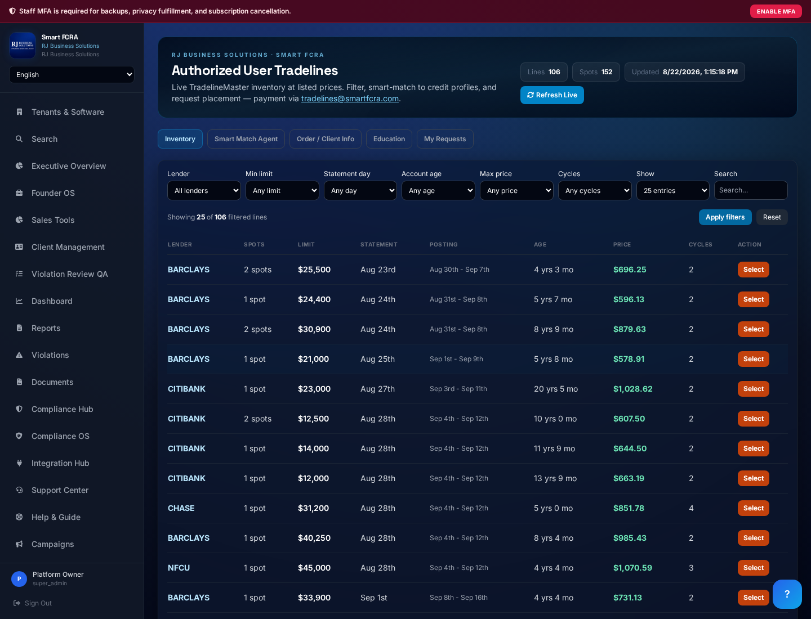

Tradelines is the authorized-user tradeline marketplace built into the platform — a supplemental revenue and client-value tool. The current live inventory shows **106 lines / 152 spots** available. Tabs include **Inventory** (default, shown), **Smart Match Agent** (AI-assisted matching of a client's profile to the best available tradelines), **Order / Client Info**, **Education**, and **My Requests**.

The Inventory table lists tradelines from major issuing banks — **Barclays, Citibank, Chase, NFCU** all appear in the current data — with pricing ranging roughly **$578 to $1,070** per spot depending on the card's age, limit, and utilization profile. A filter row lets staff narrow by bank, price, or credit-limit range. The platform earns a **12.5% markup** on tradeline sales through its TradelineMaster integration (see `docs/FEATURES.md` section 6).

## 25. Team Management {#25-team}

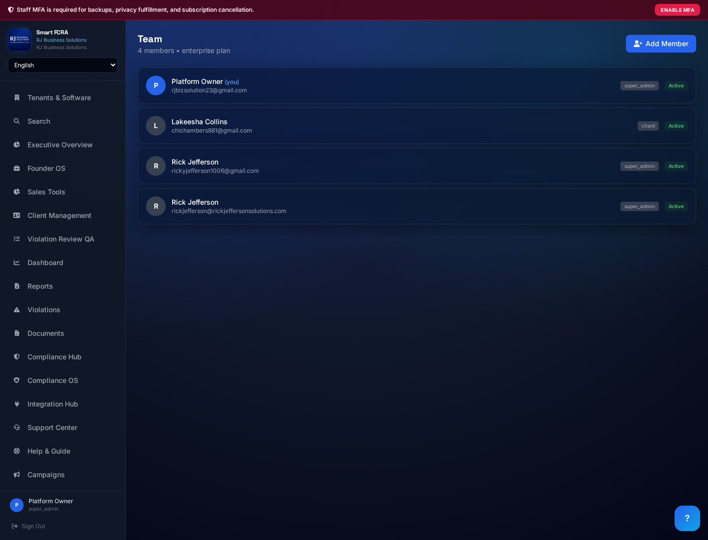

Team Management lists every user account inside the organization — in the current data, **4 members** on the **Enterprise plan**:

| Name | Role |
|---|---|
| Platform Owner | `super_admin` |
| Lakeesha Collins | `client` |
| Rick Jefferson | `super_admin` |
| Rick Jefferson *(second account)* | `super_admin` |

An **Add Member** button lets an admin invite a new staff account, assign their role, and set their initial permissions.

> **Support tip:** it is normal and expected for a small organization to show a client account (like Lakeesha Collins) inside the same Team list as staff — the Team page lists every user tied to the org regardless of role, not just staff.

## 26. Security & Devices {#26-security-devices}

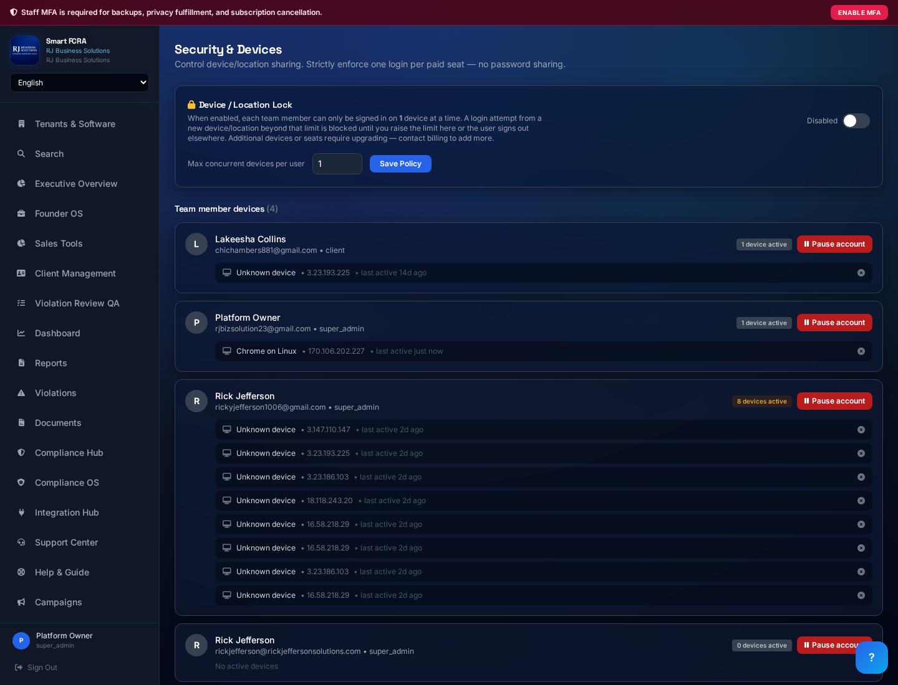

This is the admin-level device and location lock control panel (see also the Positive Money manual's Section 3 and 12 for the tenant-facing explanation of this same feature). A top-level **Device/Location Lock** toggle (currently **Disabled** in the screenshot) turns the policy on or off for the whole organization; a **Max devices** input (set to 1) and **Save Policy** button configure how many concurrent devices any one account may be logged in on when the policy is active.

Below the policy controls, each of the four team members has their own device list showing exactly which device(s)/browser(s) they're currently logged in from, with **Pause** and **Reinstate** buttons letting an admin instantly kick a device off if it looks suspicious (e.g., a stolen laptop, an ex-employee's session) and let it back on later if it was a false alarm. The Platform Owner account, for example, shows one clean, expected device: **"Chrome on Linux."**

> **This screen was affected by, and is now confirmed fixed from, the MFA-gate bug described in Section 2.4 and the technical appendix** — it previously could render incorrectly under specific navigation sequences; it now consistently shows clean, correct device data.

## 27. Settings {#27-settings}

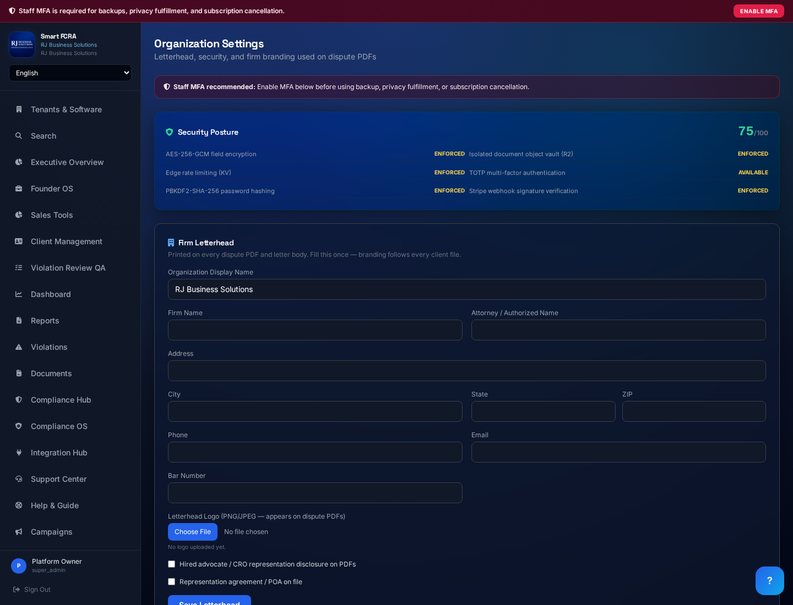

The Settings page (titled **Organization Settings**) is where an organization configures its identity and legal footing on the platform. A **Staff MFA banner** reminds admins to enforce multi-factor authentication for their team. The same **Security Posture (75/100)** control checklist from the Compliance Hub (Section 17) and Legal & Compliance (Section 30) appears here too, since it's a single organization-wide score, not three separate ones.

The **Firm Letterhead** form is the most frequently used part of this page — it captures the organization's display name (pre-filled with **"RJ Business Solutions"** in the current data), address, logo, and contact details that appear on every generated legal letter. Two compliance checkboxes and a **Save Letterhead** button complete the form.

> **Support tip:** this is exactly the same "Your Branding" concept documented in Section 2 of the Positive Money manual — every tenant fills out their own version of this same Firm Letterhead form with their own business name and logo, which is what makes each tenant's branded subdomain look and feel like their own product.

## 28. AI Studio {#28-ai-studio}

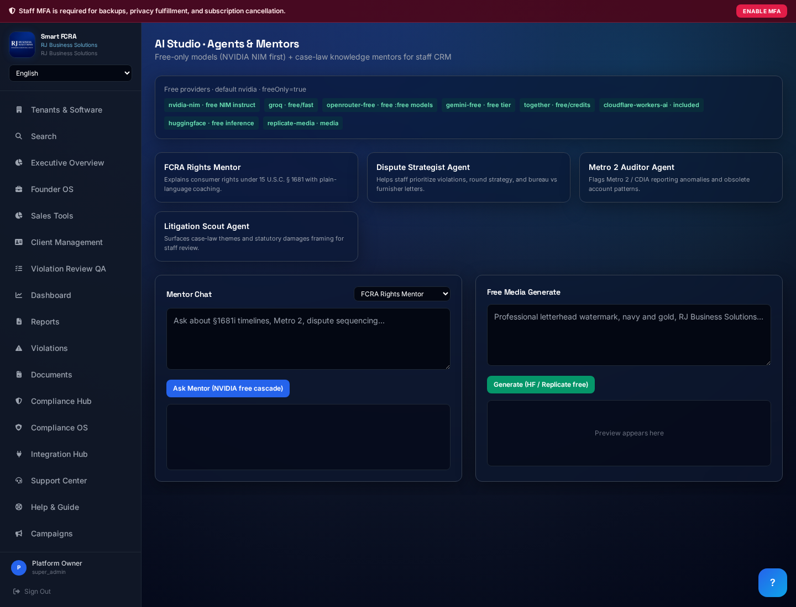

AI Studio is the home of Smart FCRA's built-in AI mentors and free media generation tools. A badge shows **8 free provider(s)** currently available — the platform's AI requests cascade automatically through **Groq → Gemini → Cloudflare Workers AI → OpenAI (free-tier only; paid keys are never used)**, so the system always tries the fastest/cheapest free option first and falls back gracefully if one provider is unavailable, with no cost passed on to the tenant.

Four **mentor personas** are available for chat:

| Mentor | Specialty |
|---|---|
| **FCRA Rights Mentor** *(Rick Jefferson persona: strategy)* | Explains consumer FCRA rights in plain language |
| **Dispute Strategist** *(Alex Rivera persona: credit tutor)* | Helps plan the best dispute approach for a case |
| **Metro 2 Auditor** *(Maya Chen persona: compliance)* | Digs into Metro 2 furnisher-reporting format violations |
| **Litigation Scout** *(Jordan Blake persona: funding)* | Flags cases with strong litigation/funding potential |

A **Mentor Chat** panel lets staff or clients converse directly with any of the four mentors, and a **Free Media Generate** panel offers image/media generation at no cost, using the same free-provider cascade.

## 29. Billing & Subscription {#29-billing}

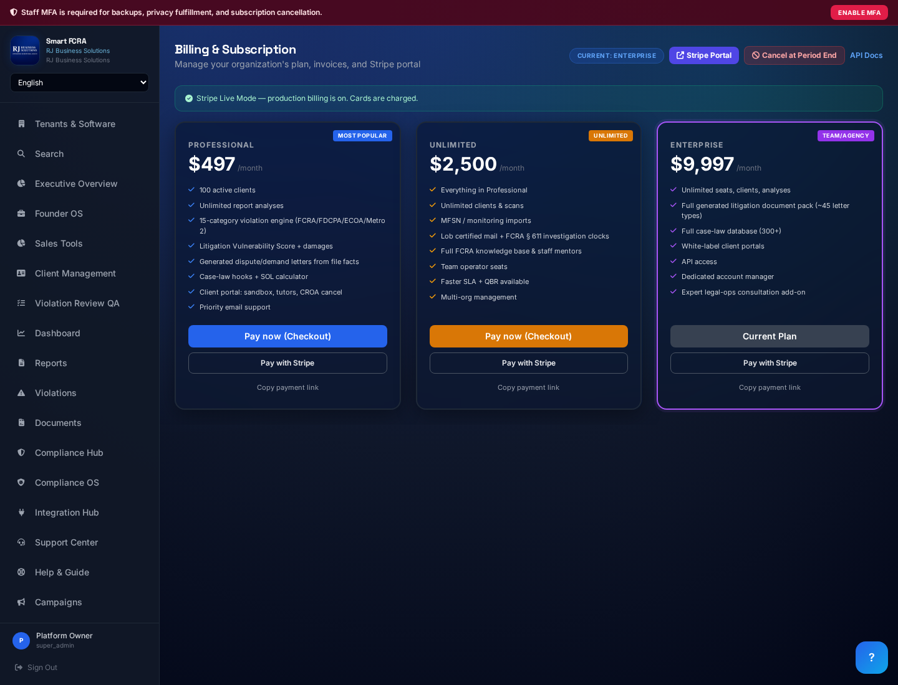

The Billing page shows the organization's current plan — **Enterprise** in the screenshot — plus a **Stripe Live Mode warning** (a reminder banner that real payment processing, not test mode, is active for this org). Three pricing tiers are displayed side-by-side with full feature lists:

| Plan | Price | Notes |
|---|---|---|
| **Professional** | $497/mo | Entry tier |
| **Unlimited** | $2,500/mo | Mid tier |
| **Enterprise** | $9,997/mo | Top tier — current plan for this org |

> **Reference:** `docs/TENANT_ONBOARDING_SOP.md` documents the exact Stripe setup for each of the three tiers, including the specific webhook events each tier's checkout flow triggers.

## 30. Legal & Compliance {#30-legal}

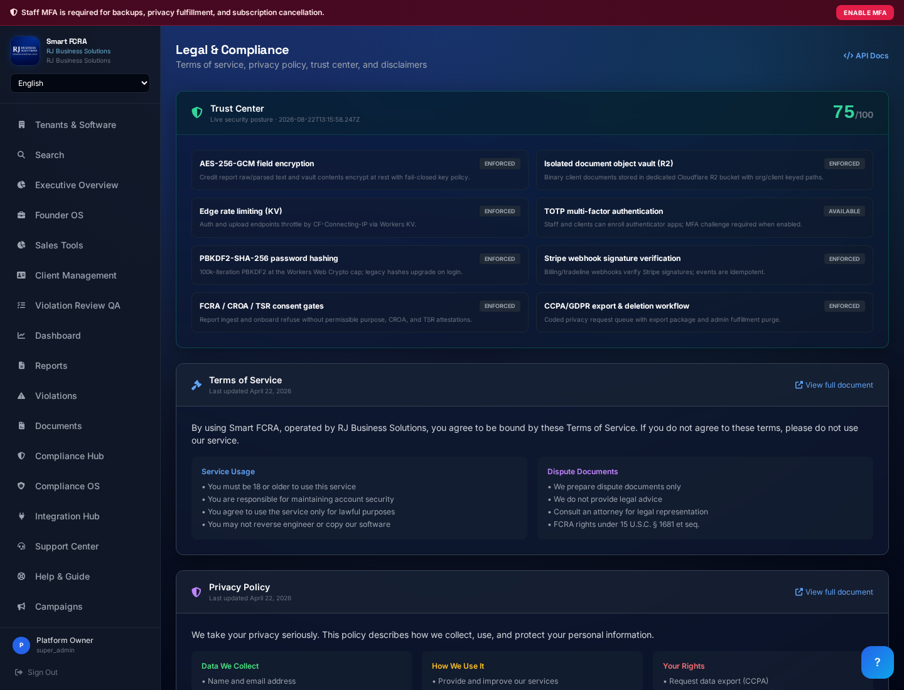

This page is the organization's public-facing **Trust Center**. It shows the same **75/100 Security Posture** score and control checklist seen in Compliance Hub (Section 17) and Settings (Section 27) — again, one unified score surfaced in three convenient places rather than three separate scores. Below that, a **Terms of Service** section and a **Privacy Policy** section (broken into "Data We Collect," "How We Use It," and "Your Rights" columns) give clients and prospects the organization's full legal disclosures in one place.

---

# Part 4 — Reference

## 31. Quick Reference / Cheat Sheet {#31-cheat-sheet}

| I need to... | Go to |
|---|---|
| Onboard a brand-new licensed business | Tenants & Software → **CREATE BUSINESS** (Section 3), then `docs/TENANT_ONBOARDING_SOP.md` |
| See what a specific tenant's dashboard looks like | Tenants & Software → find the org's row (Section 3) |
| Draft an RJ Business Solutions contract/NDA | Founder OS Suite (Section 4) |
| Get a sales pitch script or objection response | Sales Tools (Section 5) |
| Find our brand colors/logo/lead forms | Brand Library (Section 6) |
| Check demo/signup pipeline numbers | Demo Signups (Section 7) |
| Confirm whether a feature is documented | Product Map (Section 8) → `docs/FEATURES.md` |
| Build a sales value case for a prospect | ROI Calculator (Section 9) |
| See what a client sees, without asking them | Client Management → **Preview Portal** (Section 11) |
| Approve/verify an AI-flagged violation | Violation Review QA (Section 12) |
| Generate a dispute letter for a client | Client Workspace → Documents (Section 16) |
| Check bureau/furnisher response deadlines | Mailing Campaigns → USPS Resolution SLA (Section 23) |
| Order authorized-user tradelines for a client | Tradelines (Section 24) |
| Add/remove a staff member | Team Management (Section 25) |
| Kick a suspicious device off an account | Security & Devices → **Pause** (Section 26) |
| Update our firm's letterhead/branding | Settings → Firm Letterhead (Section 27) |
| Talk to an AI mentor or generate free media | AI Studio (Section 28) |
| Change plan tier or view Stripe status | Billing & Subscription (Section 29) |
| Find the approved phrase for a tricky client question | Support Center → Prohibited → Approved Phrases table (Section 20) |
| Read the full customer-service compliance rules | `docs/CUSTOMER_SERVICE_COMPLIANCE_PLAYBOOK.md` |
| Read the system-admin/suspension procedures | `docs/SYSTEM_ADMIN_SOP.md` |

## 32. Getting Help & Escalation Paths {#32-getting-help}

1. **First stop:** the in-app **Help & Guide** page (Section 21) — the 51-step guided tour and "Ask the platform guide AI" box answer most day-to-day questions instantly.
2. **This guide:** search this document (Ctrl/Cmd+F) for the page name or feature you're trying to understand.
3. **Technical/architecture questions:** `docs/ARCHITECTURE.md` and `docs/FEATURES.md` are the engineering source of truth.
4. **Customer-facing scripting/compliance questions:** `docs/CUSTOMER_SERVICE_COMPLIANCE_PLAYBOOK.md`, or the in-app Support Center (Section 20).
5. **Tenant provisioning/suspension/billing questions:** `docs/TENANT_ONBOARDING_SOP.md` and `docs/SYSTEM_ADMIN_SOP.md`.
6. **Anything you can't resolve with the above:** escalate to a platform-owner (`super_admin`) team member directly — never guess at an answer involving legal compliance, billing, or account security.

---

## Appendix A — Technical Note: The MFA-Gate Fix Behind the "Clean" Screenshots in This Guide

While preparing the screenshots for this guide, two pages — **Tenants & Software** (Section 3) and **Demo Signups** (Section 7) — were briefly found rendering the wrong page content ("Organization Settings") instead of their real data. Root-cause investigation traced this to a backend defect in the staff/admin MFA gate inside `src/index.tsx`: the gate used **naive substring path-matching** to decide which requests required a fresh MFA confirmation, and that substring logic incorrectly caught harmless, read-only `GET` requests that merely happened to share a path fragment with a protected route.

**The fix** replaced substring matching with explicit **method + exact-path rule objects**, so MFA is now only ever required for the small, specific set of destructive `POST` actions that should trigger it:

- `POST /admin/backup/trigger`
- `POST /admin/demo/prepare`
- `POST /admin/demo/load-case`
- `POST /admin/privacy-requests/:id/fulfill`
- `POST /billing/cancel`

Every ordinary read-only page view — including all 28 screens documented in this guide — is now guaranteed to render its real content without any risk of being incorrectly intercepted by the MFA gate.

This fix was committed and merged via **PR #24** (commit `c510e47`) and is live in production at https://smartfcra.com. All 28 screenshots in this guide were captured and QA-verified **after** this fix was deployed, and the three pages most likely to have been affected (Tenants & Software, Demo Signups, and Security & Devices) were specifically re-verified to confirm clean, correct rendering.

---

## Appendix B — Screenshot Index

All screenshots in this guide live in `docs/images/rj_master_guide/` and are captured at 1440×1100 resolution from the live production RJ Business Solutions platform-owner account.

| # | File | Section |
|---|---|---|
| 01 | `01_tenants_software.png` | 3. Tenants & Software |
| 02 | `02_founder_os.png` | 4. Founder OS Suite |
| 03 | `03_sales_tools.png` | 5. Sales Tools |
| 04 | `04_executive_overview.png` | 10. Executive Overview |
| 05 | `05_client_management.png` | 11. Client Management |
| 06 | `06_violation_review_qa.png` | 12. Violation Review QA |
| 07 | `07_dashboard.png` | 13. Dashboard |
| 08 | `08_reports.png` | 14. Reports |
| 09 | `09_violations.png` | 15. Violations |
| 10 | `10_documents.png` | 16. Documents |
| 11 | `11_compliance_hub.png` | 17. Compliance Hub |
| 12 | `12_compliance_os.png` | 18. Compliance OS |
| 13 | `13_integration_hub.png` | 19. Integration Hub |
| 14 | `14_support_center.png` | 20. Support Center |
| 15 | `15_help_guide.png` | 21. Help & Guide |
| 16 | `16_campaigns.png` | 22. Campaigns |
| 17 | `17_mailing_campaigns.png` | 23. Mailing Campaigns |
| 18 | `18_tradelines.png` | 24. Tradelines |
| 19 | `19_brand_library.png` | 6. Brand Library |
| 20 | `20_demo_signups.png` | 7. Demo Signups |
| 21 | `21_product_map.png` | 8. Product Map |
| 22 | `22_roi_calculator.png` | 9. ROI Calculator |
| 23 | `23_team.png` | 25. Team Management |
| 24 | `24_security_devices.png` | 26. Security & Devices |
| 25 | `25_settings.png` | 27. Settings |
| 26 | `26_ai_studio.png` | 28. AI Studio |
| 27 | `27_billing.png` | 29. Billing & Subscription |
| 28 | `28_legal.png` | 30. Legal & Compliance |

---

*Smart FCRA presented by RJ Business Solutions — "Empowering Generational Wealth"*
*This guide is an internal training and support reference. It is not a substitute for `docs/CUSTOMER_SERVICE_COMPLIANCE_PLAYBOOK.md`, `docs/SYSTEM_ADMIN_SOP.md`, or `docs/TENANT_ONBOARDING_SOP.md`, which remain the authoritative compliance and operations documents.*
