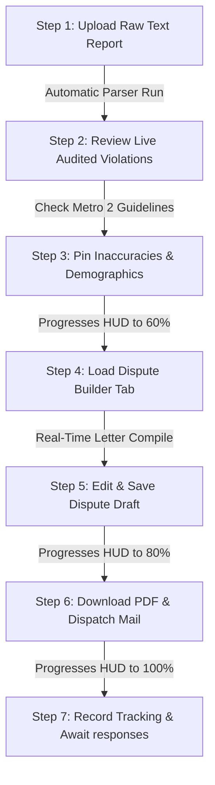

# 🧠 NEURONEDGE LABS™ — SMARTFCRA
## INTERACTIVE DISPUTE WORKSPACE OPERATING MANUAL & SOP
### The Professional Credit Litigation & Reinvestigation Suite

```
╔══════════════════════════════════════════════════════════════════════╗
║   Owner:        Rick Jefferson | RJ Business Solutions               ║
║   Address:      1342 NM 333, Tijeras, New Mexico 87059               ║
║   Website:      https://rickjeffersonsolutions.com                   ║
║   Secondary:    https://rjbusinesssolutions.org                      ║
║   Email:        support@rjbusinesssolutions.org                      ║
║   Version:      1.0.0 — Official Release SOP                         ║
╚══════════════════════════════════════════════════════════════════════╝
```

---

## 🧭 1. Executive Summary & System Overview

Welcome to **SmartFCRA™**, powered by **RJ Business Solutions**. This manual serves as the definitive Standard Operating Procedure (SOP) and operational guide for the **Interactive Dispute Workspace**.

This system is engineered for elite consumer law firms, credit repair organizations (CROs), and compliance professionals. It provides a dual-pane, litigation-backed cockpit designed to identify inaccuracies, compile high-impact, legally grounded reinvestigation letters, and track dispute campaigns dynamically under the Fair Credit Reporting Act (FCRA) and Metro 2® compliance guidelines.

### 🛡️ Core Features of the Upgraded Workspace:
1. **Dynamic Dispute Campaign HUD**: An in-app progressive tracking widget (Ingestion ➔ Audit ➔ Pinning ➔ Draft ➔ Sent) displaying campaign percentages (40% to 100%) and interactive milestones.
2. **Interactive Dispute Pinning**: Instant checkbox toggles to secure trade lines, collection items, hard inquiries, and personal demographics directly to the active dispute portfolio.
3. **Automated AI Compliance Auditor**: Real-time evaluation of Equifax, Experian, and TransUnion raw credit reports with litigation grading, damages math, and case law citations.
4. **Metro 2® Field Inspector Drawers**: Collapsible educational tables highlighting critical compliance mandates for Field 17 (Scheduled Payment Amount), Field 18 (Actual Payment Amount), Field 21 (Date of First Delinquency), and Field 25 (Date Closed).
5. **The Elite Dispute Builder**: A live-compiled letter preview pane rendering a formal 15 U.S.C. § 1681i reinvestigation letter based on the proven, high-conversion Gary A. Branch template.
6. **In-App Cloud Synchronization**: Direct database integration allowing operators to edit, save, and download dispute letters securely.

---

## 📋 2. Step-by-Step Operator Guide

Follow this standard procedure for every credit report imported into the system.

### 🔄 Operational Pipeline Visual Tracker


---

### Step 1: Ingestion & Text Upload
1. Log into your SmartFCRA tenant dashboard.
2. Select or create a **Client Profile** from your active portfolio.
3. Click on the **"Upload Credit Report"** interface.
4. Open the official credit report in HTML or raw text format. Highlight and copy the complete text (the advanced parser supports files exceeding 65,000 characters).
5. Select the matching **Credit Bureau** (Equifax, Experian, or TransUnion) and paste the text into the secure ingestion input.
6. Click **"Process Report"**. The backend parser will automatically extract and map account terms, balances, dates, history grids, and demographic info.

---

### Step 2: Review Audited Violations & Litigation Score
1. Once parsed, the system immediately redirects you to the upgraded **Interactive Dispute Workspace**.
2. **Observe Left Pane**: You will see the original raw report text with key compliance violations dynamically highlighted in yellow overlays. Hovering over any highlight reveals the violation type.
3. **Observe Right Pane**: Review the generated **Litigation Score Dashboard**:
   - **Litigation Grade**: Ratings from F to A+ based on statutory leverage.
   - **Score**: Scaled from 0 to 100, representing the probability of successfully filing a federal lawsuit.
   - **Litigation Damage Estimation**: Real-time aggregation of minimum and maximum statutory damages ($100–$1,000 per violation), estimated actual damages, punitive damages, and reasonable attorney's fees.
   - **Defendant Summary**: Interactive list of target defendants (CRAs and Furnishers) responsible for the inaccurate reporting.
   - **Litigation Action Plan**: A 7-step sequence customized based on the detected violations.

---

### Step 3: Interactive Pinning & HUD Campaign Setup
1. Look at the top of the workspace. The **RJ Dispute Campaign HUD** will load, indicating that your campaign is currently **40% Complete** (AI Compliance Audit Complete).
2. Scroll down to review the parsed cards in the **Accounts**, **Collections**, **Inquiries**, and **Demographic Info** tabs.
3. Locate the **Interactive Dispute Checkboxes** on each card.
4. **Action**: Click the checkmark to **"Pin to Campaign"** for any demographic errors or trade lines containing inaccuracies:
   - For demographics: Select incorrect spelling, outdated addresses, or invalid SSN formats.
   - For accounts: Pin any account displaying missing or inconsistent values (such as unpaid charge-offs with empty scheduled payment fields).
5. **HUD Progress Feedback**: As soon as you pin the first item, a success toast notification appears, the progress bar animates forward to **60% Complete**, and the HUD status shifts to: *"Dispute Pinning: [N] Item(s) Selected"*.

---

### Step 4: Access the Dispute Builder Tab
1. Navigate to the **6th tab** in the workspace tab list: **"Dispute Builder"**.
2. **Review Options**: 
   - **Select Dispute Bureau**: Choose the bureau that will receive the letter (defaults to the report's parsed bureau).
   - **Toggle Demographics**: Use the quick switches to include or exclude parsed client names, SSNs, DOBs, and addresses.
3. **Observe the Live Compiled Letter Pane**:
   - The central document pane automatically compiles Gary A. Branch's high-conversion § 1681i reinvestigation letter.
   - The recipient address automatically populates the official postal address of the targeted credit bureau.
   - The client's personal details are injected cleanly with zero trailing spaces.
   - The pinned inaccuracies are dynamically formatted into a clean, numbered bullet list in the exact required format:
     `• [Creditor Name] (Account #: [Account Number]): [Bureau-Specific Dispute Verbiage]`

---

### Step 5: Draft Editing & Database Synchronization
1. The Compiled Letter pane is **fully editable**. If you need to add custom legal verbiage or specific client context, click directly inside the text editor and make your changes.
2. Once satisfied with the layout and content, click **"Save Dispute Draft"**.
3. **Database Sync Feedback**: The app makes an asynchronous `PUT` call to the secure Hono backend database. Upon saving, a green success toast notification appears, the campaign HUD advances to **80% Complete**, and the status updates to: *"Dispute Letter Draft Compiled & Saved"*.

---

### Step 6: Document Export & Physical Dispatch
1. Click **"Download Printable PDF"** to export the saved draft as a professionally styled document.
2. **Assemble Dispute Package**: Attach copies of the client's identifying documents to prevent bad-faith stalling from the bureaus:
   - Copy of State Issued Driver's License or ID Card.
   - Copy of Social Security Card.
   - Copy of a recent Utility Bill or Bank Statement showing the current mailing address.
3. **Dispatch via Certified Mail**: Mail the package physically using **USPS Certified Mail with Return Receipt Requested**.
4. **Action**: Once sent, click **"Mark as Dispatched"** on the campaign HUD dashboard.
5. **Campaign Completion**: The progress bar advances to **100% Complete** (Dispute Campaign Dispatched via Certified Mail) and locks the workspace state to prevent accidental data overwrites.

---

## 🔍 3. Metro 2® Field Inspection Quick Reference

When reviewing charge-off accounts, the system automatically checks for violations of Metro 2® guidelines and the FCRA accuracy mandate (15 U.S.C. § 1681e(b)). Use this quick reference to understand the exact reporting rules for critical fields.

| Field ID | Metro 2® Field Name | Mandated Standard for Active Unpaid Charge-Offs |
|:---:|---|---|
| **Field 17** | **Scheduled Payment Amount** | **Must be reported as 0 or empty** depending on the status, but **cannot reflect active collection scheduled payments** while simultaneously reporting a closed status. |
| **Field 18** | **Actual Payment Amount** | **Must be reported as 0** unless a payment was actually processed. Reporting payment demands on closed, unpaid charge-offs is inaccurate. |
| **Field 21** | **Date of First Delinquency (DOFD)** | **Mandatory.** Must remain fixed and represent the date the account first went delinquent leading to the charge-off. It cannot drift or match the charge-off date. |
| **Field 25** | **Date Closed** | **Mandatory.** Closed dates must reflect the month and year the creditor terminated the trade line. Leaving this empty while reporting "closed" status is incomplete. |

> [!IMPORTANT]
> Under 15 U.S.C. § 1681i, credit bureaus are required to investigate any consumer dispute regarding incomplete, inaccurate, or inconsistent reporting. If they fail to correct or delete non-compliant fields within 30 days, they face statutory and actual damages under § 1681n (willful non-compliance) and § 1681o (negligent non-compliance).

---

## 🛡️ 4. CROA & FCRA Compliance Guide

This system has been designed with strict adherence to consumer protection laws. Ensure your operators follow these guidelines to maintain full compliance.

### 1. Credit Repair Organizations Act (CROA) Compliance
- **No Advance Fees**: If you are operating as a credit repair organization, you **must not charge or receive any money** prior to fully performing the services outlined in your contract (15 U.S.C. § 1679b(b)).
- **Mandatory Disclosures**: Ensure that the **CROA Disclosure Statement** is presented to and signed by the client prior to executing any contract.
- **Contract Specifications**: Contracts must be in writing, dated, signed, and include a detailed explanation of services, payment terms, and the client's right to cancel within 3 business days.

### 2. Fair Credit Reporting Act (FCRA) Compliance
- **Permissible Purpose**: Only access or import credit reports for clients who have provided **explicit, written authorization** (15 U.S.C. § 1681b).
- **Legitimate Disputes Only**: Only pin and dispute items that the client has verified as inaccurate, incomplete, or unverifiable. Do not file frivolous disputes or dispute accurate information in bad faith.

---

## ❓ 5. Troubleshooting & Frequently Asked Questions

### Q1: The report parsed, but some critical demographic fields are missing.
* **Resolution**: If the raw text of the credit report lacks structured headings for SSN or Date of Birth, the parser might skip them. The upgraded demographic rendering engine includes type guards (`Array.isArray` checks) to prevent system crashes. You can manually enter or edit these details directly inside the **Dispute Builder** panel before saving the letter.

### Q2: I clicked "Save Dispute Draft" but got a server connection error.
* **Resolution**: Ensure your network is active and you are logged into your Hono session. In-app saving requires an active connection to the Honox endpoint at `/api/documents/:id`. If the error persists, copy the compiled letter from the interactive text area to your clipboard, refresh the page, and paste it back into the editor to save.

### Q3: Why does the system generate different dispute text for Equifax, Experian, and TransUnion?
* **Resolution**: Different bureaus use different reporting formats and layouts. Gary A. Branch's reinvestigation protocols mandate bureau-specific wording to target how each bureau stores and represents Metro 2® data. Customizing the verbiage by bureau dramatically increases dispute resolution success rates.

### Q4: How do I clear pinned items to start a new campaign?
* **Resolution**: Pinned dispute items are securely cached in your browser's `localStorage` to prevent loss during network disconnects. To start a clean campaign, uncheck the pinned items on the account cards, or clear your browser's site cookies and local storage.

---

## 📝 6. Standard Document Sign-off & Maintenance

This Standard Operating Procedure is reviewed regularly to maintain alignment with updated federal case law, CISA security advisories, and Metro 2® reporting guidelines.

| Prepared By | Reviewed By | Approved By | Active Date |
|---|---|---|---|
| **Rick Jefferson**<br>AGI-Level Prompt Architect | **RJ Business Solutions**<br>Quality & Compliance | **Rick Jefferson**<br>Owner & Operator | **July 7, 2026** |

---
*For support, inquiries, or feedback regarding your SmartFCRA dashboard or the Interactive Dispute Workspace templates, contact support at **support@rjbusinesssolutions.org** or visit **https://rickjeffersonsolutions.com**.*
