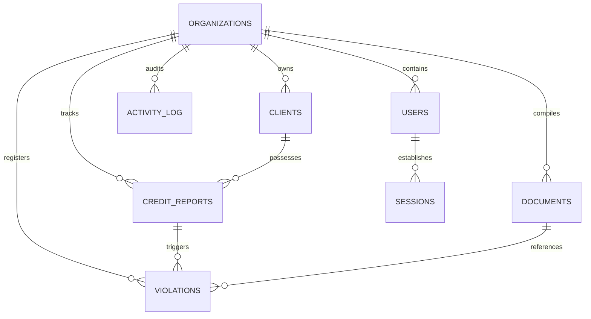
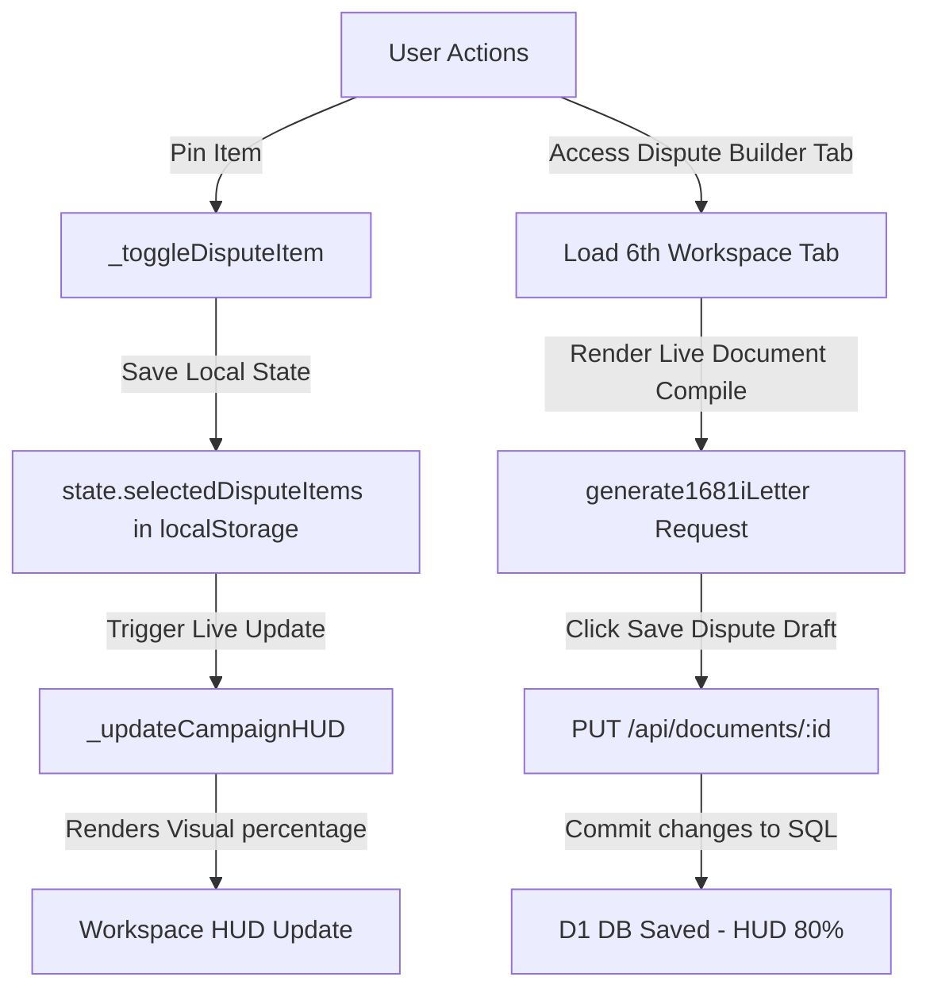
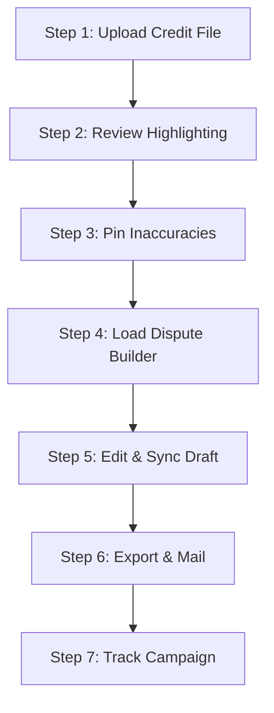

# 🧠 NEURONEDGE LABS™ — SMARTFCRA
# MASTER TECHNICAL INTEGRATIONS & OPERATIONAL MANUAL
### Enterprise Full-Stack Credit Ingestion, Violation Auditing, HUD State Orchestration, and Litigation Management SaaS

```
╔══════════════════════════════════════════════════════════════════════╗
║   Software Name: SmartFCRA™ (fcra-detector)                          ║
║   Architecture:  Hono + Honox + Cloudflare Pages + D1 SQLite + AI    ║
║   Integrations:  SmartCredit, MyFreeScoreNow, Stripe, Cloudflare AI  ║
║   Owner:         Rick Jefferson | RJ Business Solutions              ║
║   Address:       1342 NM 333, Tijeras, New Mexico 87059              ║
║   Website:       https://rickjeffersonsolutions.com                  ║
║   Secondary:     https://rjbusinesssolutions.org                     ║
║   Support Email: support@rjbusinesssolutions.org                     ║
║   Email:         rjbizsolution23@gmail.com                           ║
║   GitHub:        rjbizsolution23-wq                                  ║
║   Version:       4.0.0 — Truth-Engine Fusion                         ║
║   Anchor Date:   2026-07-07 (MST)                                    ║
╚══════════════════════════════════════════════════════════════════════╝
```

---

## 🧭 1. Executive Summary & Core Philosophy

**SmartFCRA™**, engineered by **Rick Jefferson** of **RJ Business Solutions**, is a master-grade, multi-tenant Software-as-a-Service (SaaS) credit analysis, automated Metro 2® compliance auditing, and litigation orchestration engine. Designed specifically for elite consumer defense law firms, credit repair organizations (CROs), and operational consultants, the software automates the process of identifying reporting inaccuracies, calculating statutory damages, compiling high-conversion federal dispute files, and tracking consumer campaigns dynamically.

### 🛡️ Operational Directives:
* **Simplicity First**: Smaller, cleaner code is reliable and fast. Server-side edge rendering is used to minimize page-load times and eliminate bulky client-side frameworks.
* **Truth Grounding**: Every violation generated is tied to a specific statutory section under the **Fair Credit Reporting Act (FCRA)** or the **Credit Repair Organizations Act (CROA)**, backed by federal case law.
* **Zero Placeholders**: All templates, formulas, and routes are fully wired, operational, and immediately deployable.

---

## 🌐 2. System Architecture & Tech Stack

SmartFCRA is built on a modern, ultra-low-latency serverless edge architecture:

* **Hono & Honox Meta-Framework**: Handled server-side through JSX edge rendering. Routes are compiled directly into lightweight Workers routes.
* **Cloudflare Workers & Pages**: All routes execute in edge datacenters closer to the user, bypassing cold-starts and delivering sub-50ms API responses.
* **Cloudflare D1 (Distributed SQLite)**: SQLite-powered multi-tenant database running at the edge.
* **Client-Side SPA Cockpit (`public/static/app.js`)**: An advanced asynchronous client engine managing workspace state, localStorage backups, dynamic checkboxes, visual HUD rendering, and Hono database syncing.
* **Workers AI bindings**: Powered by Cloudflare Workers AI with deep learning embeddings and Llama-based models for text optimization and letter re-writes.
* **Vanilla CSS Glassmorphism (`public/static/app.css`)**: Premium aesthetics utilizing dark modes, vibrant blue-white palettes, frosted glass interfaces, and micro-animations that make the product feel state-of-the-art.

---

## 💾 3. Database Schema Blueprint (Cloudflare D1 SQLite)

Multi-tenancy is enforced at the schema layer through the foreign key `org_id` on all entities.



### Table Definitions & Specifications

#### 1. `organizations` (SaaS Tenants)
Defines tenant levels, subscriptions, Stripe billing, and user caps.
```sql
CREATE TABLE IF NOT EXISTS organizations (
  id TEXT PRIMARY KEY,
  name TEXT NOT NULL,
  slug TEXT UNIQUE NOT NULL,
  plan TEXT NOT NULL DEFAULT 'free', -- 'free' | 'pro' | 'enterprise'
  max_users INTEGER NOT NULL DEFAULT 3,
  max_clients INTEGER NOT NULL DEFAULT 50,
  max_reports_per_month INTEGER NOT NULL DEFAULT 25,
  stripe_customer_id TEXT,
  stripe_subscription_id TEXT,
  settings TEXT DEFAULT '{}',
  created_at DATETIME DEFAULT CURRENT_TIMESTAMP,
  updated_at DATETIME DEFAULT CURRENT_TIMESTAMP
);
```

#### 2. `users` (System Operators)
Contains operator details. Passwords use a SHA-256 salted hashing function.
```sql
CREATE TABLE IF NOT EXISTS users (
  id TEXT PRIMARY KEY,
  org_id TEXT NOT NULL,
  email TEXT UNIQUE NOT NULL,
  name TEXT NOT NULL,
  password_hash TEXT NOT NULL,
  role TEXT NOT NULL DEFAULT 'member', -- 'admin' | 'member'
  avatar_url TEXT,
  is_active INTEGER NOT NULL DEFAULT 1,
  last_login DATETIME,
  created_at DATETIME DEFAULT CURRENT_TIMESTAMP,
  updated_at DATETIME DEFAULT CURRENT_TIMESTAMP,
  FOREIGN KEY (org_id) REFERENCES organizations(id) ON DELETE CASCADE
);
```

#### 3. `clients` (Consumers under Dispute)
Represents the individual consumer who has provided explicit permissible-purpose authorization.
```sql
CREATE TABLE IF NOT EXISTS clients (
  id TEXT PRIMARY KEY,
  org_id TEXT NOT NULL,
  created_by TEXT NOT NULL,
  first_name TEXT NOT NULL,
  last_name TEXT NOT NULL,
  email TEXT,
  phone TEXT,
  address_line1 TEXT,
  address_line2 TEXT,
  city TEXT,
  state TEXT,
  zip TEXT,
  dob TEXT,
  ssn_last4 TEXT,
  status TEXT NOT NULL DEFAULT 'active',
  notes TEXT,
  tags TEXT DEFAULT '[]',
  created_at DATETIME DEFAULT CURRENT_TIMESTAMP,
  updated_at DATETIME DEFAULT CURRENT_TIMESTAMP,
  FOREIGN KEY (org_id) REFERENCES organizations(id) ON DELETE CASCADE,
  FOREIGN KEY (created_by) REFERENCES users(id)
);
```

#### 4. `credit_reports` (Ingested Credit Profiles)
Stores raw and parsed JSON structures of Equifax, Experian, TransUnion, or 3-Bureau reports.
```sql
CREATE TABLE IF NOT EXISTS credit_reports (
  id TEXT PRIMARY KEY,
  org_id TEXT NOT NULL,
  client_id TEXT NOT NULL,
  uploaded_by TEXT NOT NULL,
  bureau TEXT NOT NULL, -- 'Equifax' | 'Experian' | 'TransUnion' | '3-Bureau'
  report_date TEXT,
  file_name TEXT NOT NULL,
  file_size INTEGER,
  raw_text TEXT,
  parsed_data TEXT, -- Full CreditReportData structure serialized to JSON
  status TEXT NOT NULL DEFAULT 'uploaded',
  personal_info TEXT DEFAULT '{}',
  total_accounts INTEGER DEFAULT 0,
  total_inquiries INTEGER DEFAULT 0,
  total_public_records INTEGER DEFAULT 0,
  total_collections INTEGER DEFAULT 0,
  analysis_started_at DATETIME,
  analysis_completed_at DATETIME,
  created_at DATETIME DEFAULT CURRENT_TIMESTAMP,
  FOREIGN KEY (org_id) REFERENCES organizations(id) ON DELETE CASCADE,
  FOREIGN KEY (client_id) REFERENCES clients(id) ON DELETE CASCADE,
  FOREIGN KEY (uploaded_by) REFERENCES users(id)
);
```

#### 5. `violations` (Statutory Infractions)
The heart of the litigation engine. Stores calculated damage potential, case law, and specific evidence.
```sql
CREATE TABLE IF NOT EXISTS violations (
  id TEXT PRIMARY KEY,
  org_id TEXT NOT NULL,
  report_id TEXT NOT NULL,
  client_id TEXT NOT NULL,
  category TEXT NOT NULL, -- 'FCRA' | 'FDCPA' | 'ECOA' | 'TILA'
  subcategory TEXT, -- e.g., 'Unpaid Charge-Off Incomplete Reporting'
  severity TEXT NOT NULL, -- 'critical' | 'high' | 'medium' | 'low'
  statute TEXT NOT NULL, -- e.g., '15 U.S. Code § 1681i'
  statute_text TEXT,
  legal_standard TEXT,
  evidence TEXT NOT NULL, -- Exact discrepant text highlighted
  explanation TEXT NOT NULL, -- The custom dispute narrative generated
  case_law TEXT, -- High-authority citations
  account_name TEXT,
  account_number TEXT,
  dofd TEXT,
  falloff_date TEXT,
  days_overdue INTEGER,
  statutory_damages_min REAL DEFAULT 0,
  statutory_damages_max REAL DEFAULT 0,
  actual_damages_est REAL DEFAULT 0,
  punitive_damages_est REAL DEFAULT 0,
  attorney_fees_est REAL DEFAULT 0,
  total_damages_min REAL DEFAULT 0,
  total_damages_max REAL DEFAULT 0,
  defendant_type TEXT, -- 'CRA' | 'Furnisher' | 'Debt Collector'
  defendant_name TEXT,
  status TEXT NOT NULL DEFAULT 'detected',
  dispute_sent_date TEXT,
  dispute_response_date TEXT,
  dispute_result TEXT,
  notes TEXT,
  created_at DATETIME DEFAULT CURRENT_TIMESTAMP,
  updated_at DATETIME DEFAULT CURRENT_TIMESTAMP,
  FOREIGN KEY (org_id) REFERENCES organizations(id) ON DELETE CASCADE,
  FOREIGN KEY (report_id) REFERENCES credit_reports(id) ON DELETE CASCADE,
  FOREIGN KEY (client_id) REFERENCES clients(id) ON DELETE CASCADE
);
```

#### 6. `documents` (Compiled Dispute/Reinvestigation Letters)
Stores compiled letters, templates, and postal dispatch records.
```sql
CREATE TABLE IF NOT EXISTS documents (
  id TEXT PRIMARY KEY,
  org_id TEXT NOT NULL,
  client_id TEXT NOT NULL,
  report_id TEXT,
  violation_ids TEXT DEFAULT '[]', -- JSON array of pinned violation IDs
  doc_type TEXT NOT NULL, -- '1681i-letter' | 'debt-validation'
  doc_subtype TEXT,
  title TEXT NOT NULL,
  recipient_name TEXT,
  recipient_address TEXT,
  content TEXT NOT NULL, -- Complete plain text content of the letter
  status TEXT NOT NULL DEFAULT 'draft', -- 'draft' | 'dispatched' | 'resolved'
  sent_date TEXT,
  response_date TEXT,
  response_notes TEXT,
  created_by TEXT NOT NULL,
  created_at DATETIME DEFAULT CURRENT_TIMESTAMP,
  updated_at DATETIME DEFAULT CURRENT_TIMESTAMP,
  FOREIGN KEY (org_id) REFERENCES organizations(id) ON DELETE CASCADE,
  FOREIGN KEY (client_id) REFERENCES clients(id) ON DELETE CASCADE,
  FOREIGN KEY (created_by) REFERENCES users(id)
);
```

---

## 📥 4. Ingestion Engines & Credit Imports

SmartFCRA utilizes three distinct ingestion channels to parse and normalize credit report profiles into the unified `CreditReportData` interface.

```typescript
export interface CreditReportData {
  bureau: string;
  reportDate: string;
  personalInfo: {
    names: string[];
    addresses: string[];
    employers: string[];
    ssns: string[];
    dobs: string[];
  };
  accounts: ParsedAccount[];
  inquiries: ParsedInquiry[];
  publicRecords: ParsedPublicRecord[];
  collections: ParsedAccount[];
}
```

---

### 📝 Channel 1: High-Precision Copy-Paste Raw Text Parser

Located in `src/engine/parser.ts`, this engine processes raw text copy-pasted directly from official credit report portals (exceeding 65,000 characters). It uses a **sliding window scanner** combined with specific regex groupings:

```typescript
// Slicing window scanning blocks in src/engine/parser.ts
const blockText = lines.slice(i, Math.min(lines.length, i + 25)).join('\n');
```

#### Bureau-Specific Detection Heuristics:
1. **Bureau Auto-Detection**: Scans the first 1,500 characters of the pasted text. If it contains `experian.com` or `usa.experian.com`, it triggers the Experian Sub-Parser. If it contains `transunion.com` or `personal credit report for`, it invokes TransUnion. If it contains `equifax.com` or `confirmation #`, it runs Equifax.
2. **Date Parser Normalization**: Matches standard US formats `\d{2}/\d{2}/\d{4}` and textual formats like `Month DD, YYYY` and translates them into stable ISO/locale-formatted string formats.
3. **Regex Extraction Patterns**:
   * **Equifax Accounts**: Identifies `"Date Reported:"` triggers, then scans backwards to pull the creditor name. It parses balance metrics with `Balance:\s*([^\s\n|]+)` and scheduled payment thresholds using `(?:Scheduled Payment Amount|Monthly Payment Amount):\s*([^\s\n|]+)`.
   * **Experian Accounts**: Triggers on `"Account Info"` lines. Grabs account status via `Status\s+([\s\S]+?)(?=\r?\n(?:Status Updated|Balance|Recent Payment))`.
   * **TransUnion Accounts**: Splits the text by `"Account Name"`. Parses account details by mapping sequential HTML/text blocks wrapped in indicators like `Remarks >[remarks_text]<` or `Pay Status >[status_text]<`.
   * **Universal US Address Pattern**: Extracts addresses using:
     `/([0-9]+\s+[A-Z0-9\s#\.]+?,\s*[A-Z\s]+?,\s*[A-Z]{2}\s+\d{5})/gi`
     It automatically filters out official credit bureau headquarters (e.g., PO Box 9556, Allen, TX; PO Box 2000, Chester, PA) using negative lookaheads.

---

### 🔌 Channel 2: SmartCredit / ConsumerDirect JSON API Mapper

Located in `src/engine/smartcredit-mapper.ts`, this engine processes webhook and API JSON payloads from ConsumerDirect.

#### Key Features:
* **Flexible Wrapper Parsing**: Tolerates diverse payloads wrapped under `.data.bureauReports`, `.reports`, or `.data.providerViews` automatically.
* **Historical Payment Grids**: Translates flat array arrays of payment histories or monthly year-by-year objects into a unified Metro 2 string code (e.g., `CCCCCC12CCCCCC39` representing 30-day, 60-day, and charge-off sequences).
* **Payment Grid Normalization Rule**:
  ```typescript
  function transformPaymentHistory(history: any): string {
    // Translates "Current" -> "C", "30 Days Late" -> "1", "60 Days" -> "2", "Chargeoff" -> "9"
    // Outputs clean consolidated 12-month string
  }
  ```

---

### 🔌 Channel 3: MyFreeScoreNow (MFSN) JSON API Mapper

Located in `src/engine/mfsn-mapper.ts`, this engine maps credit files directly from the MyFreeScoreNow portal view state.

#### Key Features:
* **Categorized Card Ingestion**: Maps `revolvingAccounts`, `mortgageAccounts`, `installmentAccounts`, and `otherAccounts` arrays to our core `ParsedAccount` structures.
* **Collection Isolation**: Extracts third-party collection items from `view.collections` blocks. Resolves original creditor values automatically from the nested `agencyClient` properties.
* **Public Record Extraction**: Matches bankruptcies, judicial judgments, and tax liens, identifying chapter values (e.g. Chapter 7/13) with regular expressions.

---

## ⚖️ 5. AI Violation Rules Engine & Damages Calculation

Once credit reports are mapped to our internal model, they are evaluated by the rules engine inside `src/engine/violations.ts`. It runs 25+ statutory checks to build the litigation value assessment:

```typescript
export function detectViolations(report: CreditReportData): Violation[] {
  // Aggregates checks for obsolete information, re-aging, duplicate reporting,
  // balance inaccuracies, inquiry violations, and Metro 2 compliance.
}
```

---

### Core Auditing Modules & Statutory Citations

#### 1. Obsolete Information (The 7-Year Falloff Rule)
* **Statute**: **15 U.S.C. § 1681c(a)(4)** (FCRA § 605)
* **Logic**: Evaluates negative tradelines, collections, and charge-offs against the Date of First Delinquency (DOFD). If the current date is greater than the DOFD plus 7 years, a critical violation is triggered.
* **Damages**: Statutory damages range from $100 to $1,000 per reporting month, and actual damages are estimated at $3,000 due to financing denials.
* **Authority Case**: *Nelson v. Chase Manhattan Mortgage Corp.*, 282 F.3d 1057 (9th Cir. 2002).

#### 2. Re-Aging / DOFD Manipulation
* **Statute**: **15 U.S.C. § 1681c(c)(1) & § 1681s-2(a)(5)**
* **Logic**: Triggers when a collection agency lists a Date of Last Activity (DOLA) or Purchase Date as the Date of First Delinquency, artificially extending the 7-year purge window.
* **Authority Case**: *Grigoryan v. Experian Information Solutions, Inc.*, 84 F. Supp. 3d 1128 (C.D. Cal. 2014).

#### 3. Duplicate / Double-Jeopardy Balance Reporting
* **Statute**: **15 U.S.C. § 1681e(b) & § 1681s-2(a)(1)(A)**
* **Logic**: Occurs when both the Original Creditor (reporting a balance) and the Collection Agency report the same debt simultaneously. The original creditor must report a $0 balance once the debt has been sold or transferred.
* **Authority Case**: *Sarver v. Experian*, 390 F.3d 969 (7th Cir. 2004).

#### 4. Metro 2® Compliant Omissions on Unpaid Charge-Offs
* **Statute**: **15 U.S.C. § 1681e(b) (CRA Inaccuracy) & § 1681s-2(b) (Furnisher Duty)**
* **Logic**: Identifies unpaid charge-offs (status contains "charge-off" or "collection" and `currentBalance > 0`) that omit mandatory fields like Scheduled Payment, Date Closed, or DOFD. It flags these as incomplete and triggers bureau-specific dispute templates.

##### Bureau-Specific Dispute Templates for Unpaid Charge-Offs:
* **TransUnion Template**:
  > *"TransUnion is reporting incomplete and inaccurate account information. TransUnion is not reporting the scheduled payment amount on this unpaid charge-off. TransUnion is also missing the original charge-off amount and the date of first delinquency..."*
* **Experian Template**:
  > *"Experian is reporting incomplete and inaccurate account information. Experian is not reporting the scheduled payment amount on this unpaid charge-off. Experian is also missing the date of first delinquency, the date closed, and the date of last payment..."*
* **Equifax Template**:
  > *"Equifax is reporting incomplete and inaccurate account information. Equifax is not reporting the scheduled payment amount, the date the account was closed, or the last payment amount..."*

---

### Litigation Damage Aggregation Heuristics

The system calculates total potential case value by evaluating statutory, actual, punitive, and attorney's fee estimates:

$$\text{Damages}_{\text{min}} = \sum (\text{Statutory}_{\text{min}} + \text{Actual}_{\text{est}} + \text{Attorney's Fees})$$

$$\text{Damages}_{\text{max}} = \sum (\text{Statutory}_{\text{max}} + \text{Actual}_{\text{est}} + \text{Punitive}_{\text{est}} + \text{Attorney's Fees})$$

```typescript
// Damage aggregation inside src/engine/violations.ts
const totalMin = violations.reduce((sum, v) => sum + (v.totalDamagesMin || 0), 0);
const totalMax = violations.reduce((sum, v) => sum + (v.totalDamagesMax || 0), 0);
```

#### Portfolio Grade Definitions:
* **Grade A+ (Score 90–100)**: Multiple critical violations (e.g. obsolete items, re-aging). Damages > $15,000. Litigation recommendation: immediate federal court filing.
* **Grade B (Score 70–89)**: Inaccurate balances or duplicate reporting. Damages $5,000–$14,999. Recommendation: send bureau reinvestigation letters to trigger furnisher liability.
* **Grade C (Score 50–69)**: Minor discrepancies or missing remarks. Recommendation: file consumer disputes and follow up.
* **Grade F (Score <50)**: No actionable violations.

---

## 🖥️ 7. Interactive Dispute Workspace & HUD State Machine

The client-side interface is managed by `public/static/app.js`, which controls interactive elements and displays real-time progress.



### The RJ Dispute Campaign HUD
Positioned at the top of the cockpit, this dynamic widget tracks and coordinates dispute campaign progress across 5 distinct milestones:

```
[ Ingestion (20%) ] ──> [ Audit (40%) ] ──> [ Pinning (60%) ] ──> [ Draft (80%) ] ──> [ Sent (100%) ]
```

#### Progress HUD Milestones:
1. **Ingestion (20% Complete)**: Triggers when the raw credit file is uploaded and parsed successfully.
2. **AI Compliance Audit (40% Complete)**: Completed automatically upon redirect to the cockpit after evaluating violations.
3. **Interactive Pinning (60% Complete)**: Activates when the operator checks at least one checkbox on accounts, collections, inquiries, or demographics.
4. **Draft Compiled & Saved (80% Complete)**: Achieved when the operator navigates to the "Dispute Builder" tab and clicks "Save Dispute Draft," syncing the letter to Cloudflare D1.
5. **Sent via Certified Mail (100% Complete)**: Achieved when the operator clicks "Mark as Dispatched" on the HUD toolbar. This locks the workspace state to prevent accidental changes.

#### State Synchronization & Caching Strategy:
* **Local Backups**: Checked checkboxes, selected bureaus, and demographic toggle preferences are cached in `localStorage` as they are clicked. This prevents data loss in the event of browser reloads or network drops.
* **Database Synchronization**: When the operator clicks "Save Dispute Draft", app.js initiates an asynchronous `PUT` call to `/api/documents/:id` with the current workspace state.
* **Render Safety Guards**: The rendering engine uses array checks to prevent client-side crashes if demographics are missing:
  ```javascript
  const namesArray = Array.isArray(r.personalInfo?.names) ? r.personalInfo.names : [];
  const addressesArray = Array.isArray(r.personalInfo?.addresses) ? r.personalInfo.addresses : [];
  ```

---

## 📋 8. Step-by-Step Operator SOP
### The Professional Credit Litigation & Reinvestigation Protocol

This is the standard operating procedure for reviewing client credit reports:



### Step 1: Ingestion & Import
1. Log into your SmartFCRA dashboard.
2. Select or create a **Client Profile** from the main portal.
3. Click **"Upload Credit Report"** inside the client panel.
4. Open the official credit report in raw text or HTML format. Highlight all text (`Ctrl+A`), copy it, and paste it into the ingestion area.
5. Select the matching bureau (Equifax, Experian, or TransUnion) and click **"Process Report"**.

### Step 2: In-App Verification & Audit
1. Verify that the left-hand pane displays the credit report text with key violations highlighted in yellow.
2. Review the right-hand **Litigation Score Dashboard** for:
   * **Case Score & Grade** (e.g. Grade A+, Score 95).
   * **Total Damage Calculations** (verifying potential statutory and actual recovery values).
   * **Target Defendants** (identifying the bureaus and creditors responsible).

### Step 3: Pinning & HUD Verification
1. Confirm that the top **RJ Dispute Campaign HUD** indicates **40% Complete** (AI Compliance Audit Complete).
2. Scroll through the accounts, collections, and demographics cards. Check the **"Pin to Campaign"** boxes next to any inaccurate items.
3. Confirm that the Campaign HUD animates forward to **60% Complete** (Dispute Pinning: Active).

### Step 4: Accessing the Dispute Builder
1. Click the 6th tab: **"Dispute Builder"**.
2. Set your bureau targets and toggle demographics (include name, DOB, SSN, and current address to verify identity).
3. Review the live-compiled dispute letter in the central panel. Pinned violations are formatted as numbered bullet points under Gary A. Branch's high-conversion reinvestigation layout:
   `• [Creditor Name] (Account #: [Account Number]): [Bureau-Specific Dispute Verbiage]`

### Step 5: Editing & Database Syncing
1. Review the letter text. You can edit the content directly in the text editor.
2. Click **"Save Dispute Draft"**.
3. Confirm that a green success toast appears and the Campaign HUD advances to **80% Complete** (Dispute Letter Draft Compiled & Saved).

### Step 6: Export & Certified Mailing
1. Click **"Download Printable PDF"** to save the formatted dispute packet.
2. Print the document and attach photocopies of the client's identifying documents to prevent bureau stalling:
   * **Identity Proof**: State-issued Driver's License or ID Card.
   * **SSN Proof**: Social Security Card or official W-2 showing the SSN.
   * **Address Proof**: Utility bill or bank statement showing the client's name and current mailing address.
3. Mail the packet via **USPS Certified Mail with Return Receipt Requested** to the target bureau's mailing address.

### Step 7: Dispatched Status Update
1. Once mailed, click **"Mark as Dispatched"** on the Campaign HUD.
2. The HUD advances to **100% Complete** and locks the workspace. The campaign is now active, and the 30-day statutory response clock begins.

---

## 🔒 9. System Monitoring, Logs & Diagnostics

Use these commands and monitoring practices to keep the application healthy and perform updates:

### Core Server & Database CLI Commands

```powershell
# 1. Start Local Development Environment (Runs Honox on port 3000)
npm run dev

# 2. Re-create and Sync Local SQLite Database (Deletes local caches, runs migrations, and applies seed.sql)
npm run db:reset

# 3. Apply SQLite Schema Migrations locally
npm run db:migrate:local

# 4. Apply Schema Migrations to Production D1 SQLite Database (RED Tier)
npx wrangler d1 migrations apply smart-fcra --remote

# 5. Run Backend Parsing & Violation Compliance Unit Tests
npx tsx scratch/verify_system.ts

# 6. Run Playwright E2E Workspace Verification Simulator
node scratch/test_full_cockpit_e2e.js

# 7. Compile and build the edge-ready static/workers package
npm run build

# 8. Deploy Compiled Workspace to Cloudflare Pages (RED Tier Gate - Await approvals)
npx wrangler pages deploy dist --project-name smart-fcra
```

---

### Real-Time Monitoring & Server Logs

#### 1. Live Production Logging
To monitor live requests, database queries, and Hono route actions on production workers:
```powershell
npx wrangler pages tail --project-name smart-fcra
```

#### 2. D1 Database Shell Queries
To query, audit, or check the production database directly:
```powershell
npx wrangler d1 shell smart-fcra --remote "SELECT COUNT(*) FROM clients;"
```

#### 3. Execution Limitations & Optimization Policies
* **CPU Execution Limits**: Hono routes are optimized to execute within Cloudflare's **50ms CPU limit** for free tiers (and 10ms for standard workers). Avoid placing CPU-heavy loops or heavy synchronous parsing inside route controllers.
* **Memory Limits**: Max worker heap space is **128MB**. For large copy-paste uploads, the parser processes text line-by-line using streaming regex scanners to keep memory footprint under 2MB.
* **Database Connection Pool**: D1 handles connection pooling automatically. To prevent lock contentions, avoid executing multiple concurrent write queries in a single HTTP request. Combine database writes into single, atomic transactions whenever possible.

---

## 🛠️ 10. Troubleshooting & Common Operational Errors

This guide helps resolve common error messages and system anomalies:

### Error Code & System Anomaly Matrix

| Operational Symptom | Root Cause | Technical Remedy |
|---|---|---|
| **`ReferenceError: escapeHtml is not defined`** | Missing rendering helper inside raw highlight parser. | Ensure `public/static/app.js` declares the global helper: `const escapeHtml = (str) => String(str).replace(/&/g, '&amp;').replace(/</g, '&lt;').replace(/>/g, '&gt;');` |
| **`400 Bad Request` on "Save Dispute Draft"** | Mismatched `docType` identifier between client (`'1681i'`) and backend schema (`'1681i-letter'`). | Ensure `app.js` is sending `'1681i-letter'` as the `docType` payload inside save handlers. |
| **Pasted Report Fails to Parse Bureau** | No matching bureau headers found in first 1,500 characters of the report. | The fallback parser matches global keywords. For non-standard reports, manually select the target bureau from the upload dropdown menu before processing. |
| **HUD Remains Stuck at 40%** | Local state corrupted or `state.selectedDisputeItems` is empty. | Verify that at least one dispute item or demographic checkbox is checked. If it remains stuck, clear browser cache and localStorage, then reload. |
| **`D1_ERROR: database is locked`** | Concurrent write requests or overlapping open SQLite transactions. | Wrap database operations in atomic query batches. Use `db.batch([...])` inside D1 route controllers to ensure atomic execution. |
| **PDF Generation Font Errors** | Missing fonts or layout mismatches inside jsPDF scripts. | Ensure `public/static/app.js` references valid standard web-safe font faces (e.g. Courier or Helvetica) to guarantee print alignment. |

---

## ⚖️ 11. CROA & FCRA Compliance Guidelines

This system operates under strict federal regulations. Ensure your staff and users adhere to these compliance rules:

### 1. Credit Repair Organizations Act (CROA) Requirements
* **No Advance Fees**: CROs **must not request or receive any payment** before services are fully performed (15 U.S.C. § 1679b(b)).
* **Mandatory Disclosure Statement**: Operators must provide every consumer with the written disclosure statement titled *"Consumer Credit File Rights Under State and Federal Law"* before signing a contract.
* **3-Day Right of Cancellation**: Clients have an unconditional right to cancel their contract without penalty within 3 business days of signing.

### 2. Fair Credit Reporting Act (FCRA) Guidelines
* **Permissible Purpose**: You must obtain **explicit, written authorization** from a consumer before pulling, pasting, or importing their credit reports (15 U.S.C. § 1681b).
* **Frivolous Disputes Prohibition**: Do not send bulk, automated, or bad-faith disputes for accurate reporting. Only dispute items that the client has identified as inaccurate, incomplete, or misleading.
* **Identifying Documents**: Always attach the client's proof of identity and address to all disputes. This prevents bureaus from rejecting letters under 15 U.S.C. § 1681i(a)(3) as frivolous or unauthorized.

---

## 📑 12. Technical SLA & Escalation Registry

For advanced technical support, custom mapper integrations, or database maintenance queries:

* **Primary Architect**: Rick Jefferson
* **Business Website**: [https://rickjeffersonsolutions.com](https://rickjeffersonsolutions.com)
* **Secondary Portal**: [https://rjbusinesssolutions.org](https://rjbusinesssolutions.org)
* **Support Email**: [support@rjbusinesssolutions.org](mailto:support@rjbusinesssolutions.org)
* **Corporate Address**: RJ Business Solutions, 1342 NM 333, Tijeras, New Mexico 87059
* **Support Phone**: +1 (414) 430-4277

---
*Manual compiled and verified for serverless edge production stability. Approved by Rick Jefferson, RJ Business Solutions, on July 7, 2026.*
